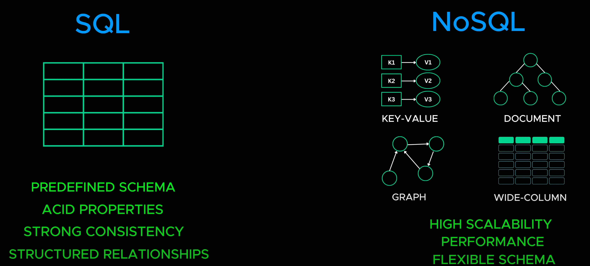

# SQL or NoSQL

- SQL databases store data in tables with a strict predefined schema and they follow ACID properties. Because of these guarantees, SQL databases are ideal for applications that require strong consistency and structured relationship such as banking system

  > Cơ sở dữ liệu SQL lưu trữ dữ liệu trong các bảng với một lược đồ được xác định trước nghiêm ngặt và chúng tuân theo các thuộc tính ACID. Do những đảm bảo này, cơ sở dữ liệu SQL lý tưởng cho các ứng dụng đòi hỏi tính nhất quán mạnh mẽ và mối quan hệ có cấu trúc như hệ thống ngân hàng

- No SQL databases on the other hand and designed for high scalability and performance. They don't require a fixed schema and use different data models including key-values stores, document stores, graph databases and wide column stores which are optimized for large sacle distributed data

  > Mặt khác, không có cơ sở dữ liệu SQL nào được thiết kế để có khả năng mở rộng và hiệu suất cao. Chúng không yêu cầu lược đồ cố định và sử dụng các mô hình dữ liệu khác nhau bao gồm kho lưu trữ khóa-giá trị, kho lưu trữ tài liệu, cơ sở dữ liệu đồ thị và kho lưu trữ cột rộng được tối ưu hóa cho dữ liệu phân tán lớn

  

- So which one should you use ?

  - If you need structured relationship data with a strong consistency ==> SQL is better choice.
    > Nếu bạn cần dữ liệu mối quan hệ có cấu trúc với tính nhất quán cao ==> SQL thì tốt hơn
  - If you need high scalability, flexible schema ==> NoSQL is better choice.
    > Nếu bạn cần khả năng mở rộng cao, lược đồ linh hoạt ==> NoSQL là lựa chọn tốt hơn.

- Many modern application use both SQL and NoSQL together.
