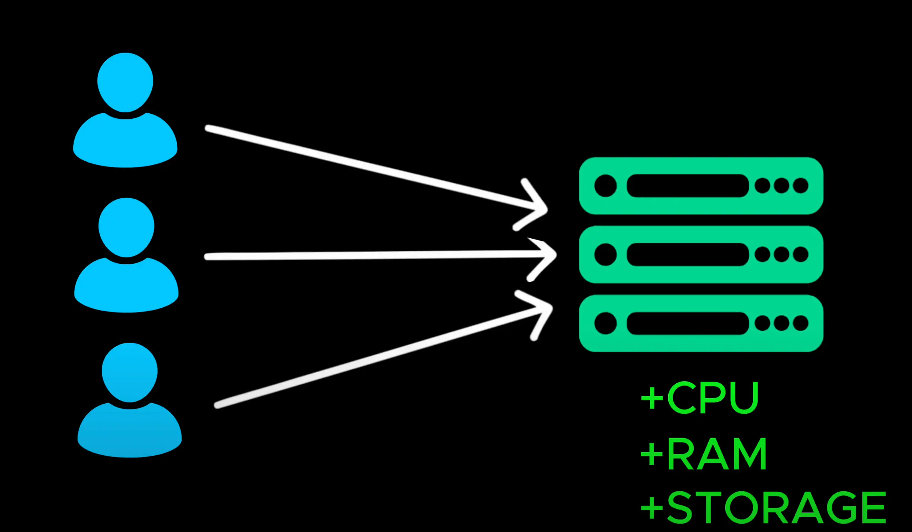

# Vertical Scaling

- As our your user base grows, so does the number of requests hitting our application servers

  > khi cơ sở người dùng của bạn tăng lên, số lượng yêu cầu truy cập vào máy chủ ứng dụng của chúng tôi cũng tăng lên

- One of the quickest solutions is to upgrade the existing servers by adding more CPU, RAM or storage

  > Một trong những giải pháp nhanh nhất là nâng cấp máy chủ hiện có bằng cách thêm CPU, RAM hoặc bộ nhớ

- This approach is calling vertical scaling or scaling up which make a single machine more powerful

  > Cách tiếp cận này được gọi là mở rộng theo chiều dọc hoặc mở rộng theo chiều ngang, giúp một máy đơn lẻ mạnh hơn

  

- But there are some major limitation with this approach. You can't keep upgrading a sever forever

  > Nhưng có một số hạn chế lớn với cách tiếp cận này. Bạn không thể tiếp tục nâng cấp máy chủ mãi mãi

- Every machine has a maximum capacity.

  > Mỗi máy có một công suất tối đa

- More powerful servers become exponentially more expensive

  > Máy chủ mạnh hơn trở nên đắt hơn theo cấp số nhân

- If this one server crashes, the entire system goes down

  > nếu máy chủ này bị sập, toàn bộ hệ thống sẽ ngừng hoạt động

- So while vertical scaling is a quick fix, it's not a long term solution for handling high traffic and ensuring system reliability

  > Vì vậy, trong khi việc mở rộng theo chiều dọc là một giải pháp nhanh chóng, thì đó không phải là giải pháp lâu dài để xử lý lưu lượng truy cập cao và đảm bảo độ tin cậy của hệ thống

- Let's look at a better approach, one that makes our system more scalable and fault tolerant

  > Hãy xem xét một cách tiếp cận tốt hơn, một cách tiếp cận giúp hệ thống của chúng ta có khả năng mở rộng hơn và chịu lỗi tốt hơn

- Instead of upgrading a single server, what if we add more servers to share the load ?

  > Thay vì nâng cấp một máy chủ duy nhất, tại sao chúng ta không thêm nhiều máy chủ hơn để chia sẻ tải?

- This approach is called horizontal scaling or scaling out where we distribute the workload across multiple machine

  > Cách tiếp cận này được gọi là mở rộng theo chiều ngang hoặc mở rộng quy mô nơi chúng ta phân phối khối lượng công việc trên nhiều máy

Open [Horizontal Scaling](./13_horizontal_scaling.md)
