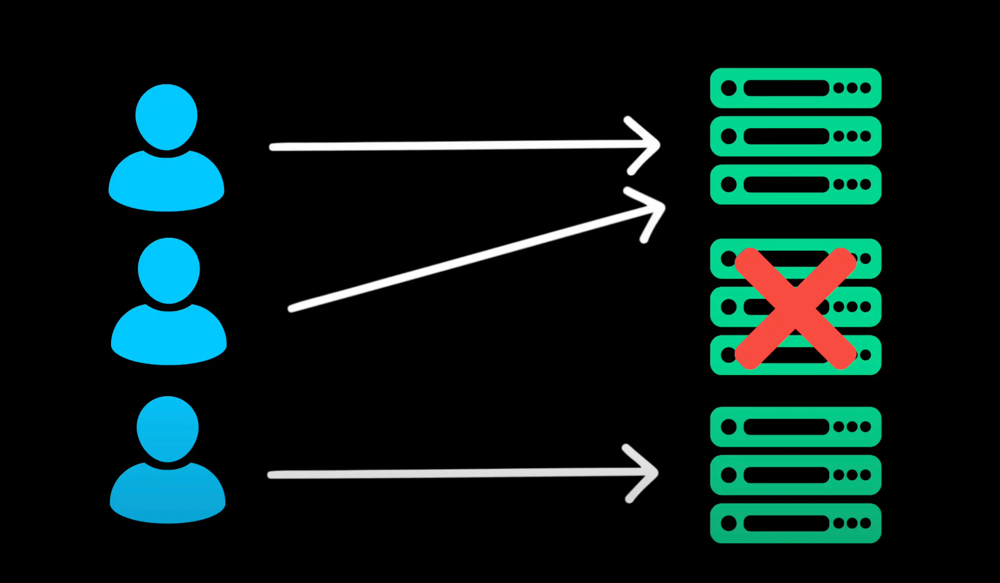

# Horizontal Scaling

- More server>s is equal to more capacity which mean the system can handle increasing traffic more effectively

  > Nhiều máy chủ hơn tương đương với nhiều công suất hơn, nghĩa là hệ thống có thể xử lý lưu lượng truy cập ngày càng tăng hiệu quả hơn

- If one servers goes down, orther can takes over which improve reliability

  > Nếu một máy chủ ngừng hoạt động, máy chủ khác có thể tiếp quản để cải thiện độ tin cậy

- But horizontal scaling introduces a new challenge

  > Nhưng việc mở rộng theo chiều ngang lại mang đến một thách thức mới

- How do client know which server to connect to ?

  > Làm thế nào để khách hàng biết được máy chủ nào để kết nối đến ?

- This is where a load balancer come in.
  > Đây là nơi mà bộ cân bằng tải xuất hiện

Open [Load Balancer](./14_load_balancer.md)
