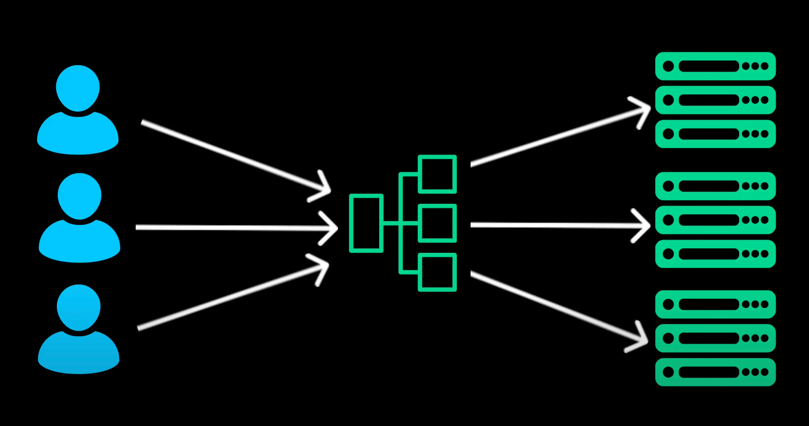
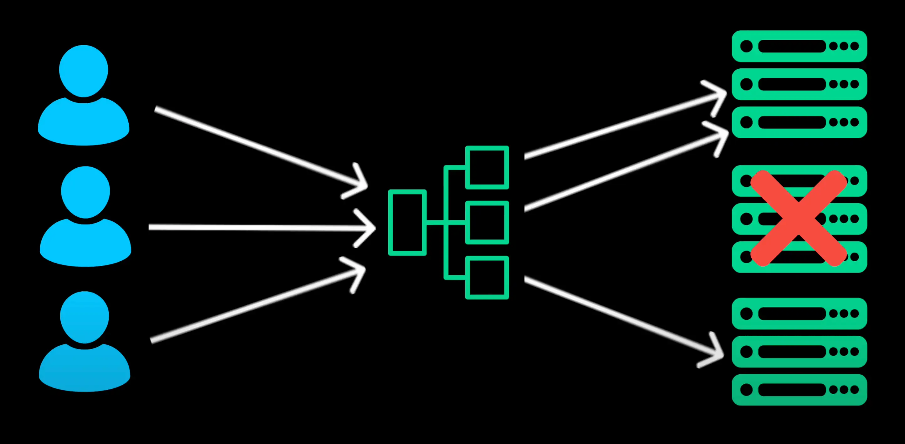
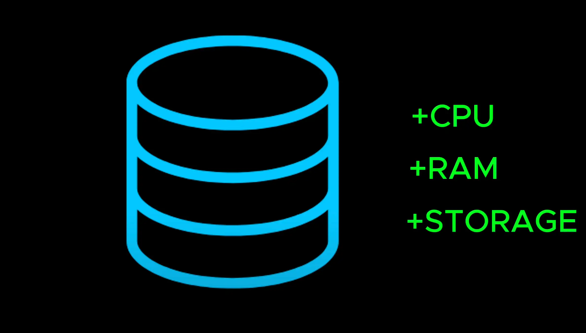

# Load Balancer

- A load balancer sits between client and backend servers acting a traffic manager that distributes request

  > Bộ cân bằng tải nằm giữa máy khách và máy chủ phụ trợ đóng vai trò là trình quản lý lưu lượng phân phối yêu cầu

- If one server crashes the load balancer automatically redirects traffic to another healthy servers.

  > Nếu một máy chủ bị sập, bộ cân bằng tải sẽ tự động chuyển hướng lưu lượng đến các máy chủ khỏe mạnh khác

- But how does a load balancer device which server should handle the next request ?

  > Nhưng làm thế nào một thiết bị cân bằng tải biết máy chủ nào sẽ xử lý yêu cầu tiếp theo?

- It is a load balancing algorithm such as Round-Robin, Least Connections, IP Hashing.

  > Đây là một thuật toán cân bằng tải như Round-Robin, Least Connections, IP Hashing

- So far we talked about scaling our applications servers.

  > Cho đến nay chúng ta đã nói về việc mở rộng quy mô máy chủ ứng dụng của mình.

- But as traffic grows the volume of data also increases. At first we can scale a database vertically by adding more cpu, ram, storage similar to application servers. But there is a limit of how much a single machine can handle
  > Nhưng khi lưu lượng truy cập tăng lên thì khối lượng dữ liệu cũng tăng theo. Đầu tiên, chúng ta có thể mở rộng cơ sở dữ liệu theo chiều dọc bằng cách thêm nhiều CPU, RAM, lưu trữ tương tự như máy chủ ứng dụng. Nhưng có một giới hạn về số lượng mà một máy có thể xử lý

- So let's explore other database scaling technique that can help manage large volume of data efficiently

  > Vì vậy, hãy cùng khám phá kỹ thuật mở rộng cơ sở dữ liệu khác có thể giúp quản lý khối lượng dữ liệu lớn một cách hiệu quả

- One of the quickest and most effective ways to speed up database read queries is [Indexing](./15_indexing.md)
  > Một trong những cách nhanh nhất và hiệu quả nhất để tăng tốc truy vấn đọc cơ sở dữ liệu là lập chỉ mục
