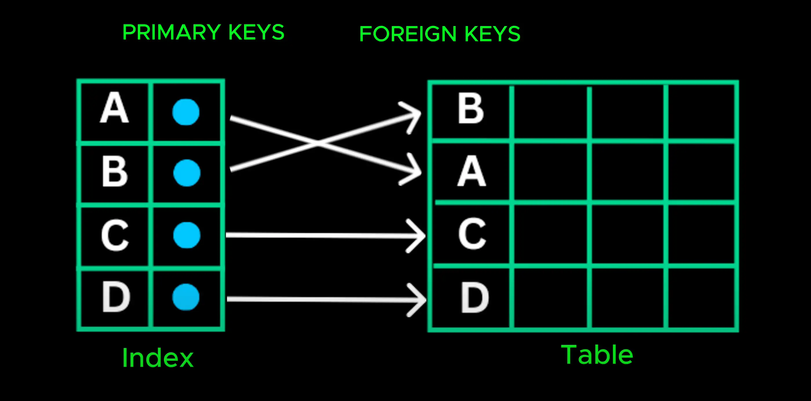
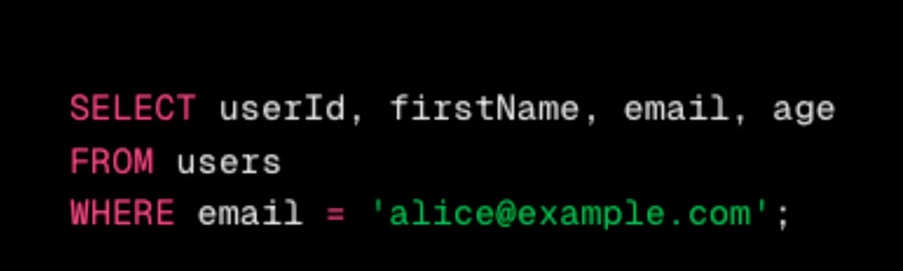

# Indexing

- Think of it like index page back of a book. Instead of flipping through every page, you jump directly to the relevant section

  > Hãy nghĩ về nó như trang mục lục ở mặt sau của một cuốn sách. Thay vì lật từng trang, bạn nhảy thẳng đến phần có liên quan

- A database index works the same way. Its a super efficient lookup table that helps the database quickly local the require data without scanning the entire table
  > Chỉ mục cơ sở dữ liệu hoạt động theo cùng một cách. Đây là bảng tra cứu siêu hiệu quả giúp cơ sở dữ liệu nhanh chóng xác định vị trí dữ liệu cần thiết mà không cần quét toàn bộ bảng

- An index is stored column values along with pointer to actual data rows in the table. Index are typically created on columns that are frequently queries such as primary key, foreign key and columns frequently used in where conditionss
  > Một chỉ mục được lưu trữ các giá trị cột cùng với con trỏ đến các hàng dữ liệu thực tế trong bảng. Chỉ mục thường được tạo trên các cột thường xuyên được truy vấn chẳng hạn như khóa chính, khóa ngoại và các cột thường được sử dụng trong các điều kiện where

- While indexes speed up read, they slow down writes since the index needs to be updated whenever data change. That why, we should only index the most frequently accessed column

  > Trong khi các chỉ mục tăng tốc độ đọc, chúng làm chậm tốc độ ghi vì chỉ mục cần được cập nhật bất cứ khi nào dữ liệu thay đổi. Đó là lý do tại sao chúng ta chỉ nên lập chỉ mục cho cột được truy cập thường xuyên nhất

- Indexing can significantly improve read performance. But what if even indexing isn't enough and our single database server can't handle the growing number of read request

  > Việc lập chỉ mục có thể cải thiện đáng kể hiệu suất đọc. Nhưng nếu ngay cả việc lập chỉ mục cũng không đủ và máy chủ cơ sở dữ liệu duy nhất của chúng ta không thể xử lý được số lượng yêu cầu đọc ngày càng tăng thì sao?

- That's where our next database scaling technique, [replication](./16_replication.md), comes in
