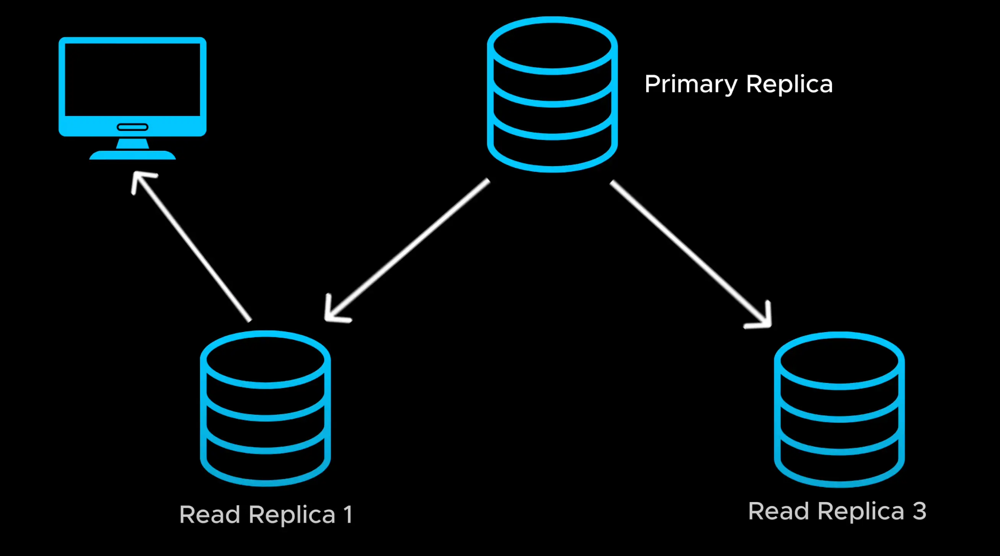

# Replication

- Just like we added more application servers to handle increasing traffic, we can scale our database by creating copies of it across multiple servers. Here is how it's work.

  > Cũng giống như chúng tôi đã thêm nhiều máy chủ ứng dụng hơn để xử lý lưu lượng truy cập ngày càng tăng, chúng tôi có thể mở rộng cơ sở dữ liệu của mình bằng cách tạo các bản sao của nó trên nhiều máy chủ. Đây là cách thức hoạt động.

- We have multiple read replicas that handle read queries. Whenever data is written to primary database. It gets copied to read replica so that they stay in sync. Replication improve the read performance since read request are spread across multiple replicas reducing the load on this one.

  > Chúng tôi có nhiều bản sao đọc xử lý các truy vấn đọc. Bất cứ khi nào dữ liệu được ghi vào cơ sở dữ liệu chính. Nó được sao chép vào bản sao đọc để chúng được đồng bộ. Sao chép cải thiện hiệu suất đọc vì yêu cầu đọc được phân bổ trên nhiều bản sao, giảm tải cho bản sao này

- This also improved availability since if the primary replica fails, a read replica can take over as the new primary. Replication is great for scaling read heavy application
  > Điều này cũng cải thiện tính khả dụng vì nếu bản sao chính bị lỗi, bản sao đọc có thể tiếp quản như bản sao chính mới. Sao chép rất tuyệt vời để mở rộng ứng dụng đọc nhiều

