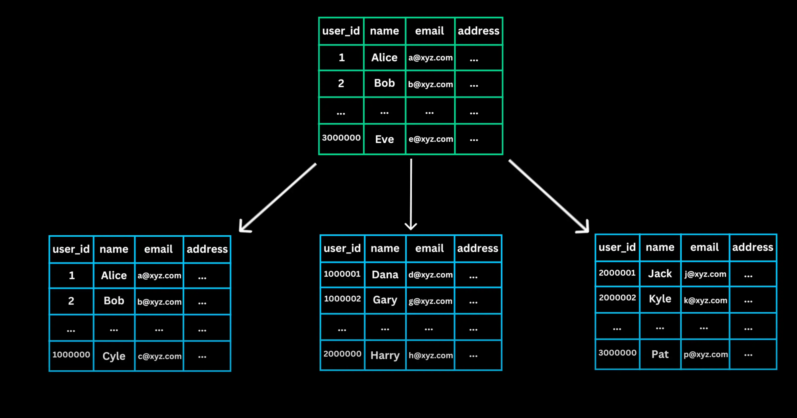
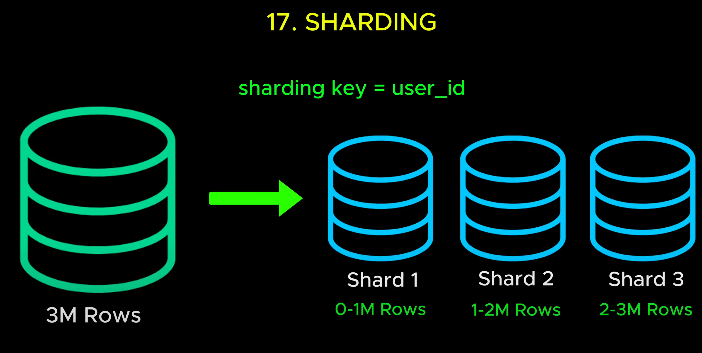

# Sharding

- But what if we need to scale write operation or store huge amount of data

  > Nhưng nếu chúng ta cần mở rộng hoạt động ghi hoặc lưu trữ lượng dữ liệu lớn thì sao?

- Let's say our service became popular it now has millions of users and our database has grows to terabytes of data.

  > Giả sử dịch vụ của chúng tôi trở nên phổ biến và hiện có hàng triệu người dùng và cơ sở dữ liệu của chúng tôi đã tăng lên đến terabyte

- A single database server will eventually struggle to handle all this data efficiently.

  > Một máy chủ cơ sở dữ liệu duy nhất cuối cùng sẽ gặp khó khăn trong việc xử lý tất cả dữ liệu này một cách hiệu quả

- Instead of keeping everything in one place, we split the database into smaller, more manageable pieces and distribute them across multiple servers

  > Thay vì giữ mọi thứ ở một nơi, chúng tôi chia cơ sở dữ liệu thành các phần nhỏ hơn, dễ quản lý hơn và phân phối chúng trên nhiều máy chủ

- This technique is called Sharding.

  

## Here is how it works

- We divide the database into smaller parts called Shards. Each Shard contains a subset of the total data. Data distributed based on the sharding key for example user ID

  > Chúng tôi chia cơ sở dữ liệu thành các phần nhỏ hơn gọi là Shards. Mỗi Shard chứa một tập hợp con của tổng dữ liệu. Dữ liệu được phân phối dựa trên khóa phân mảnh, ví dụ như ID người dùng

- By distributing data this way, we reduce database load since each Shard handles only a portion of queries and speed up read and write performance since queries are distributed across multiple Shards instead of hitting a single database

  > Bằng cách phân phối dữ liệu theo cách này, chúng tôi giảm tải cơ sở dữ liệu vì mỗi Shard chỉ xử lý một phần truy vấn và tăng tốc hiệu suất đọc và ghi vì các truy vấn được phân phối trên nhiều Shard thay vì truy cập vào một cơ sở dữ liệu duy nhất.

- Signing is also referred to as **Horizontal Partitioning** since it splits data by rows
  > Ký cũng được gọi là **Phân vùng ngang** vì nó chia dữ liệu theo hàng

Open [Vertical Partitioning](./18_vertical_partitioning.md)
