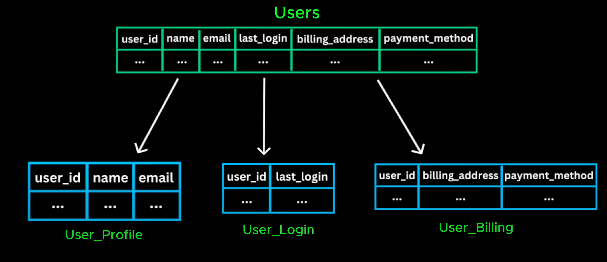

# Vertical Partitioning

- But what if the issue isn't the number of rows but rather number of column ?

  > Nhưng nếu vấn đề không phải là số hàng mà là số cột thì sao?

- In such case, we use vertical partitioning where we split database by columns

  > Trong trường hợp như vậy, chúng tôi sử dụng phân vùng theo chiều dọc, trong đó chúng tôi chia cơ sở dữ liệu theo các cột

- Imagine we have a user table that stores profile detais, login history, billing infomation. As this table grows, queries become slower because table must scan many columns even when a request only needs a few specific fields

  > Hãy tưởng tượng chúng ta có một bảng người dùng lưu trữ thông tin hồ sơ, lịch sử đăng nhập, thông tin thanh toán. Khi bảng này phát triển, các truy vấn trở nên chậm hơn vì bảng phải quét nhiều cột ngay cả khi một yêu cầu chỉ cần một vài trường cụ thể

- To optimize this we use vertical partitioning where we split user table into smaller, more focused tables based on users patterns.

  > Để tối ưu hóa điều này, chúng tôi sử dụng phân vùng theo chiều dọc, trong đó chúng tôi chia bảng người dùng thành các bảng nhỏ hơn. bảng tập trung hơn dựa trên mẫu người dùng.

- This improves query performance since each request only scans relevant columns instead of the entire table. It also reduce unnecessary disk i/o making data retrieve data quicker

  > Điều này cải thiện hiệu suất truy vấn vì mỗi yêu cầu chỉ quét các cột có liên quan thay vì toàn bộ bảng. Nó cũng làm giảm việc nhập/xuất đĩa không cần thiết làm cho dữ liệu truy xuất dữ liệu nhanh hơn

- However no matter how much we optimize database, retrieve data from disk is always slower than retrieving it from memory

  > Tuy nhiên, bất kể chúng ta tối ưu hóa cơ sở dữ liệu như thế nào, việc truy xuất dữ liệu từ đĩa luôn chậm hơn so với việc truy xuất dữ liệu từ bộ nhớ.

- What if we could store frequently accessed data in-memory? This is called [Caching](./19_caching.md)
  > Sẽ thế nào nếu chúng ta có thể lưu trữ dữ liệu thường xuyên truy cập trong bộ nhớ?
