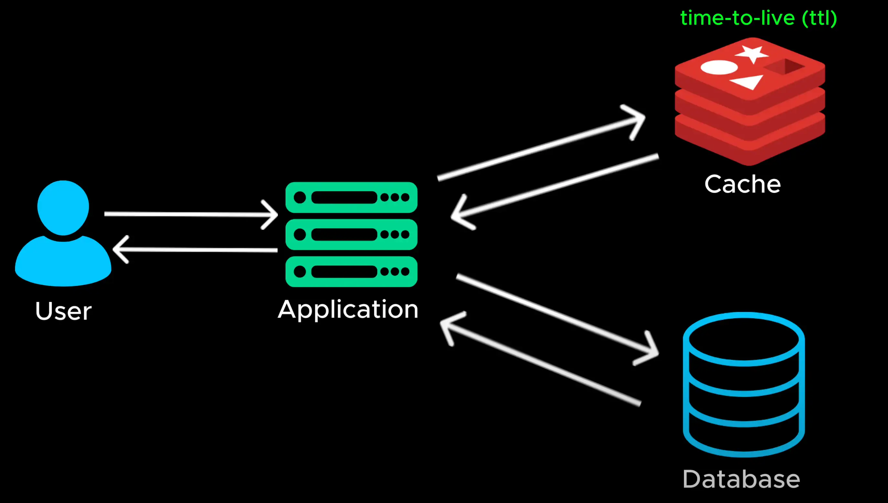

# Caching

- Caching is used to optimize the performance of a system by storing frequently accessed data in memory instead of repeatedly fetching it from database

  > Bộ nhớ đệm được sử dụng để tối ưu hóa hiệu suất của hệ thống bằng cách lưu trữ dữ liệu thường xuyên truy cập trong bộ nhớ thay vì liên tục lấy dữ liệu từ cơ sở dữ liệu

- One of the most common caching strategies is the cache aside pattern

  > Một trong những chiến lược lưu trữ đệm phổ biến nhất là mô hình lưu trữ đệm sang một bên

- Here is how it works. When a user request the data, the application first check the cache. If data is in the cache it's returned instantly avoiding a database call. If data is not in the cache, the application retrieve from the database. It stores it in the cache for future request and return it to the user. Next time the same data in requested, It's served directly from cache, making the request much faster

  > Đây là cách thức hoạt động. Khi người dùng yêu cầu dữ liệu, ứng dụng đầu tiên sẽ kiểm tra bộ nhớ đệm. Nếu dữ liệu nằm trong bộ nhớ đệm, ứng dụng sẽ trả về ngay lập tức, tránh phải gọi cơ sở dữ liệu. Nếu dữ liệu không nằm trong bộ nhớ đệm, ứng dụng sẽ truy xuất từ ​​cơ sở dữ liệu. Ứng dụng sẽ lưu trữ dữ liệu trong bộ nhớ đệm để yêu cầu trong tương lai và trả về cho người dùng. Lần sau, cùng dữ liệu được yêu cầu, ứng dụng sẽ phục vụ trực tiếp từ bộ nhớ đệm, giúp yêu cầu nhanh hơn nhiều

- To prevent outdated data from being served we use time to live value or TTL
  > Để ngăn dữ liệu lỗi thời được phục vụ, chúng tôi sử dụng giá trị thời gian sống hoặc TTL

