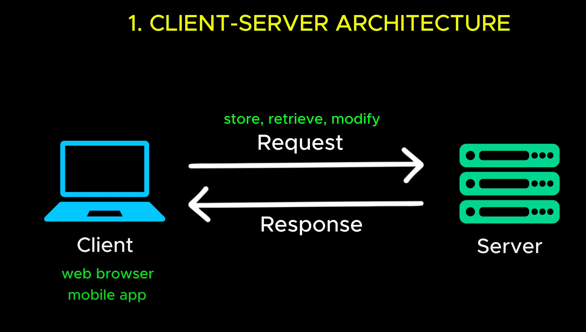

# Client-Server Architecture

- Almost web application that you use is built on this simple yet powerful (**mạnh mẽ**) concepts called: Client-Server Architecture.

- Here is how it works. On one side you have a client, this could be a web browsers, a mobile app or any orther frontend application. And on the other side you have server a machine (**máy móc**) that runs continuously (**liên tục**) waiting to handle (**xử lý**) imcoming request (**yêu cầu**).

- The client send a request to store (**lưu trữ**), retrive (**lấy lại**) or modify (**sửa đổi**) data. The server receives (**nhận được**) the request processes (**xử lý**) it, perform (**thưc hiện** ) the necessary operations (**các hoạt động cần thiết**) and send back a response.

- This sound simple right? But there is a bit question. How does client even know where to find the server ? (**Làm sao khách hàng biết nơi tim thấy máy chủ ?**)

- A client doesn't magically (**một cách kỳ diệu**) know where a server is. It need an address to local communicate (**giao tiếp**) with it.

Open: [IP Adrress](./2_ip_address.md)
