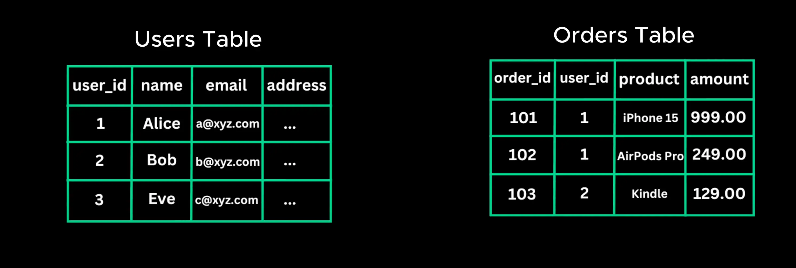
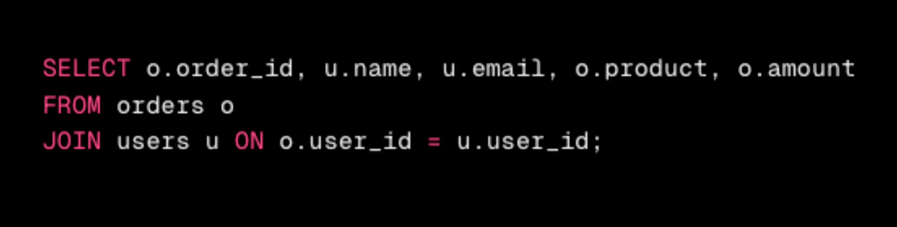
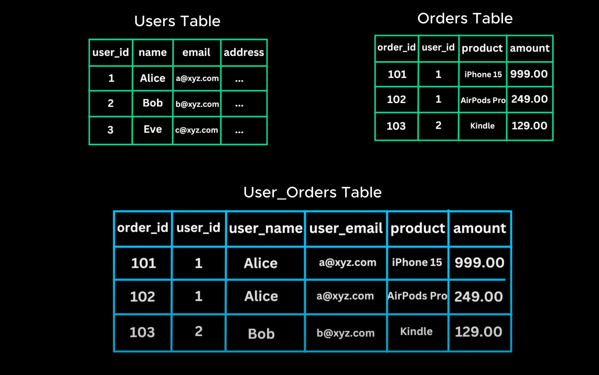
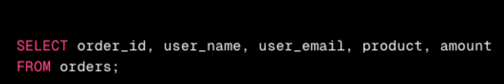

# Denormallization

- Let's look at next, database scaling technique

  > Hãy cùng xem xét kỹ thuật mở rộng cơ sở dữ liệu tiếp theo

- Most, relational database, use normalization to store data efficiently by breaking it into separate tables.

  > Hầu hết, cơ sở dữ liệu quan hệ, sử dụng chuẩn hóa để lưu trữ dữ liệu hiệu quả bằng cách chia dữ liệu thành các bảng riêng biệt

- While this reduce reduntacing, it's aslo introduces joins. When retrieving data from multiple tables, the database must combine them using JOIN operations

  > Mặc dù điều này làm giảm sự dư thừa nhưng cũng tạo ra sự kết nối.Khi lấy dữ liệu từ nhiều bảng, cơ sở dữ liệu phải kết hợp chúng bằng cách sử dụng các hoạt động JOIN

  

  

- Which can slow down queries as the dataset grows. Denormalization reduce the number of join by combine relate data into single table even if it means some data get duplicated

  > Có thể làm chậm các truy vấn khi tập dữ liệu tăng lên. Denormalization giảm số lượng liên kết bằng cách kết hợp dữ liệu liên quan vào một bảng duy nhất ngay cả khi điều đó có nghĩa là một số dữ liệu bị trùng lặp.

- Example, instead of keeping users and orders separate table, we create user order table that stores user details along with the latest orders.

  > Ví dụ, thay vì giữ bảng người dùng và đơn hàng riêng biệt, chúng tôi tạo bảng đơn hàng người dùng lưu trữ thông tin chi tiết về người dùng cùng với các đơn hàng mới nhất

- Now, when retrieving a user's order history, we don't need JOIN operation. The data is already stored together leading to faster queries and better read performance.

  > Bây giờ, khi truy xuất lịch sử đơn hàng của người dùng, chúng ta không cần thao tác s JOIN. Dữ liệu đã được lưu trữ cùng nhau dẫn đến truy vấn nhanh hơn và hiệu suất đọc tốt hơn.

  

  

- Denormalized is often used in read heavy application where speed is more critical. But the downside is it leads to increased storage and more complex update request
  > Denormalized thường được sử dụng trong ứng dụng đọc nặng, nơi tốc độ quan trọng hơn. Nhưng nhược điểm là nó dẫn đến tăng dung lượng lưu trữ và yêu cầu cập nhật phức tạp hơn

---

---

**Không cần.** Với một ứng dụng nhỏ (\~10.000 truy vấn/ngày), bạn **không nên dùng denormalization** ngay từ đầu, trừ khi có lý do rất cụ thể.

---

### ✅ Vì sao không cần?

1. **Mức truy cập thấp**:

   - 10.000 truy vấn/ngày ≈ \~7 truy vấn/phút → quá thấp so với ngưỡng cần tối ưu cực đoan.
   - Hệ quản trị CSDL quan hệ (MySQL, Postgres) xử lý mức này rất tốt, kể cả có JOIN.

2. **Denormalization tăng độ phức tạp**:

   - Dễ bị **lỗi dữ liệu không đồng bộ** khi update.
   - Phải viết **logic update phức tạp hơn** (vd: user đổi tên → phải cập nhật ở nhiều nơi).
   - Khó maintain về sau, đặc biệt khi schema thay đổi.

3. **Tối ưu sớm là premature optimization**:

   - Ứng dụng nhỏ nên **ưu tiên code rõ ràng, dễ bảo trì**.
   - Cứ để mọi thứ chuẩn hóa, đến khi **thật sự gặp bottleneck về hiệu năng** mới tối ưu sau.

---

### 📌 Khi nào nên cân nhắc denormalize?

- App bạn bắt đầu scale lên hàng **triệu truy vấn/ngày**.
- Cần đáp ứng latency ở mức **milliseconds**.
- Dữ liệu ít thay đổi, chủ yếu là **read-heavy**.
- Có các thao tác JOIN quá phức tạp hoặc query chậm rõ rệt dù đã index.

---

### 👉 Gợi ý thực tế

Với app dưới 10K truy vấn/ngày:

- Cứ dùng thiết kế **normalized** gọn gàng, rõ ràng.
- Khi cần truy vấn nhanh hơn, có thể:

  - Dùng **index phù hợp**.
  - Cache kết quả truy vấn phổ biến (Redis).
  - Tách read/write DB nếu bắt đầu tăng tải.

---

Tóm lại:
**Không cần denormalization cho app nhỏ.** Tối ưu hóa sớm quá mức dễ gây phức tạp không đáng.

Mình có thể [gợi ý kiến trúc database phù hợp với app quy mô nhỏ](f) hoặc [xem giúp bạn cấu trúc bảng hiện tại để tối ưu query](f).
