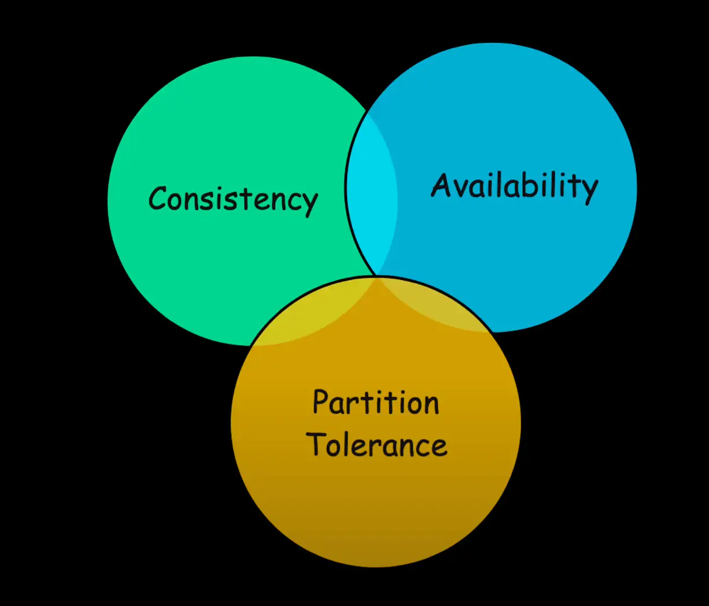
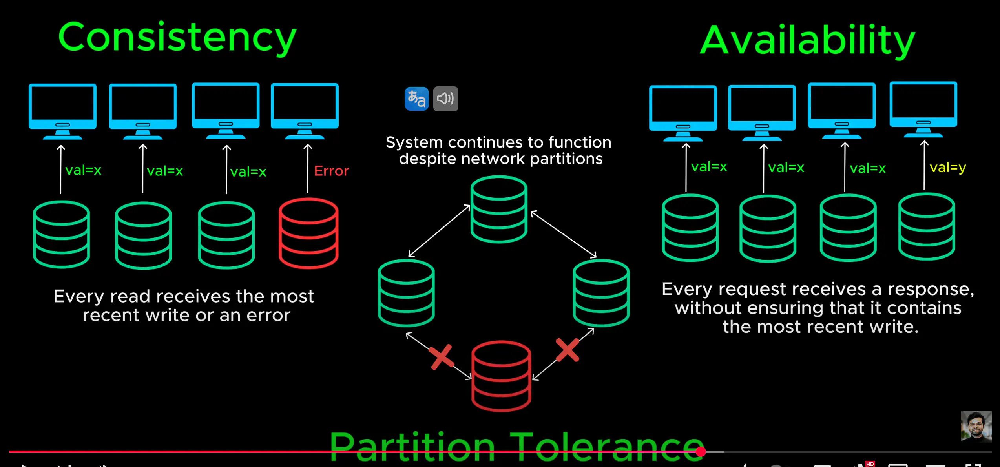

# Cap Theorem (Định lý mũ)

- As we scale our system across multiple servers databases and data centers we enter the world of distributed systems.

  > khi chúng tôi mở rộng hệ thống của mình trên nhiều máy chủ, cơ sở dữ liệu và trung tâm dữ liệu, chúng tôi bước vào thế giới của các hệ thống phân tán

- one of the fundamental principles of distributed systems is the cap theorem which states that no distributed system can achieve all three of the following at the same time

  > một trong những nguyên lý cơ bản của hệ thống phân tán là định lý mũ, định lý này nêu rằng không có hệ thống phân tán nào có thể đạt được cả ba điều sau cùng một lúc

- consistency, availability and partition tolerance since network failures are inevitable we must choose between consistency plus partition tolerance or availability plus partition tolerance if you want to learn about cap theorem in more detail you can check out this article on my blog called Cap theorem explained
  > tính nhất quán, tính khả dụng và dung sai phân vùng vì lỗi mạng là điều không thể tránh khỏi, chúng ta phải lựa chọn giữa tính nhất quán cộng với dung sai phân vùng hoặc tính khả dụng cộng với dung sai phân vùng nếu bạn muốn tìm hiểu chi tiết hơn về định lý cap, bạn có thể xem bài viết này trên blog của tôi có tên là Giải thích định lý cap

