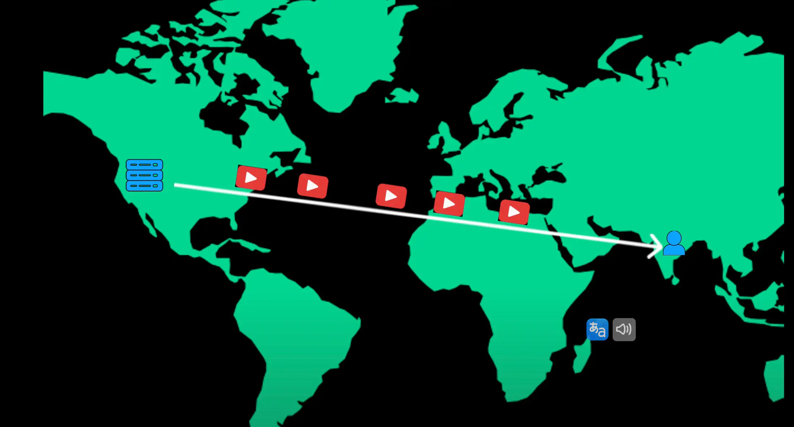

# Blob storage

- Most modern applications don't just store text record they also need to handle images videos PDFs and other large files traditional databases are not designed to store large unstructured files efficiently
  > Hầu hết các ứng dụng hiện đại không chỉ lưu trữ bản ghi văn bản mà còn cần xử lý hình ảnh, video, PDF và các tệp lớn khác. Cơ sở dữ liệu truyền thống không được thiết kế để lưu trữ các tệp lớn không có cấu trúc một cách hiệu quả.
- so what's the solution we use blob storage like Amazon S3 blobs are like individual files like images videos or documents these blobs are stored inside logical containers or buckets in the cloud each file gets a unique URL making it easy to retrieve and serve over the web
  > vậy giải pháp chúng ta sử dụng là gì lưu trữ blob như Amazon S3 blob giống như các tệp riêng lẻ như hình ảnh video hoặc tài liệu các blob này được lưu trữ bên trong các thùng chứa hoặc thùng chứa logic trên đám mây mỗi tệp có một URL duy nhất giúp dễ dàng truy xuất và phục vụ trên web

- There are several advantages with using blob storage like scalability, pay as you go model, automatic replication, easy access

  > Có một số lợi thế khi sử dụng lưu trữ blob như khả năng mở rộng, mô hình trả tiền khi sử dụng, sao chép tự động, dễ dàng truy cập

- A common use case is to stream audio or video files to user applications in real time but streaming the video file directly from blob storage can be slow especially if the data is stored in a distant location
  > Một trường hợp sử dụng phổ biến là truyền phát tệp âm thanh hoặc video đến các ứng dụng của người dùng theo thời gian thực nhưng truyền phát tệp video trực tiếp từ bộ lưu trữ blob có thể chậm, đặc biệt nếu dữ liệu được lưu trữ ở một vị trí xa

- Example imagine you are in India trying to watch a YouTube video that's hosted on a server in California since the video data has to travel across the world this could lead to buffering and slow load times
  > Ví dụ hãy tưởng tượng bạn đang ở Ấn Độ và cố gắng xem một video YouTube được lưu trữ trên một máy chủ ở California vì dữ liệu video phải truyền đi khắp thế giới, điều này có thể dẫn đến tình trạng đệm và thời gian tải chậm

- A content delivery network or CDN solves this problem
  > Mạng phân phối nội dung hoặc CDN giải quyết vấn đề này
