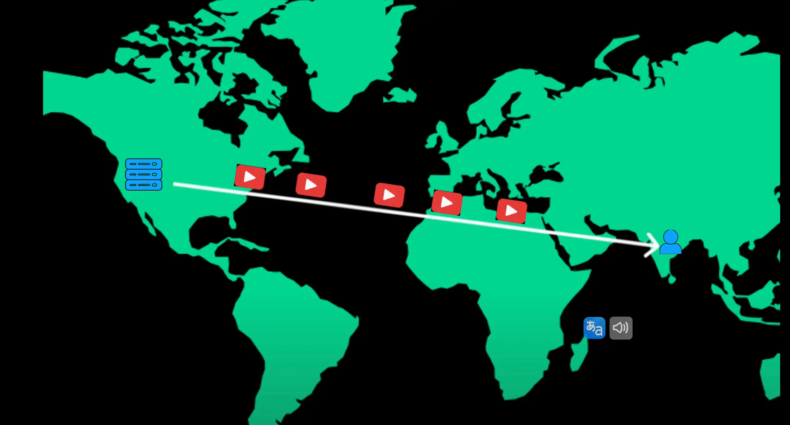

# Context Delivery Network (CDN)

- Example imagine you are in India trying to watch a YouTube video that's hosted on a server in California since the video data has to travel across the world this could lead to buffering and slow load times
  > Ví dụ hãy tưởng tượng bạn đang ở Ấn Độ và cố gắng xem một video YouTube được lưu trữ trên một máy chủ ở California vì dữ liệu video phải truyền đi khắp thế giới, điều này có thể dẫn đến tình trạng đệm và thời gian tải chậm

- A content delivery network or CDN solves this problem by delivering content faster to users based on their location

  > Mạng phân phối nội dung hoặc CDN giải quyết vấn đề này bằng cách phân phối nội dung nhanh hơn cho người dùng dựa trên vị trí của họ

- A CDN is a global network of distributed servers that work together to deliver web content like HTML pages, JavaScript files, images and videos to users based on their geographic location since content is served from the closest CDN server users experience faster load times with minimal buffering
  > CDN là mạng lưới toàn cầu gồm các máy chủ phân tán hoạt động cùng nhau để phân phối nội dung web như các trang HTML, tệp JavaScript, hình ảnh và video cho người dùng dựa trên vị trí địa lý của họ vì nội dung được phục vụ từ máy chủ CDN gần nhất, người dùng sẽ có thời gian tải nhanh hơn với thời gian đệm tối thiểu

