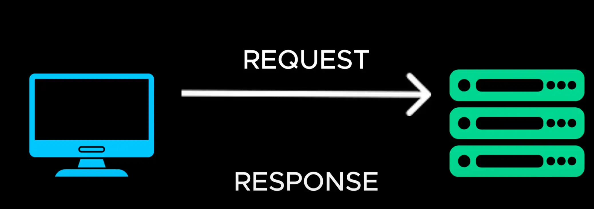
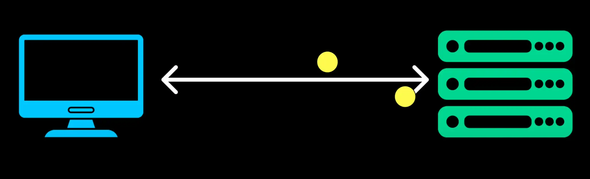
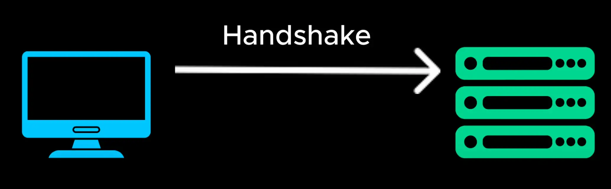
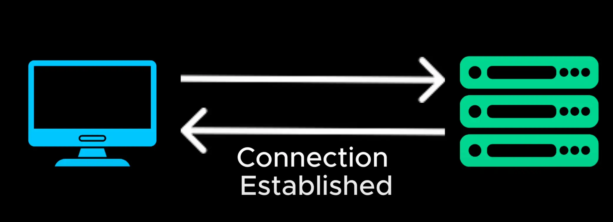
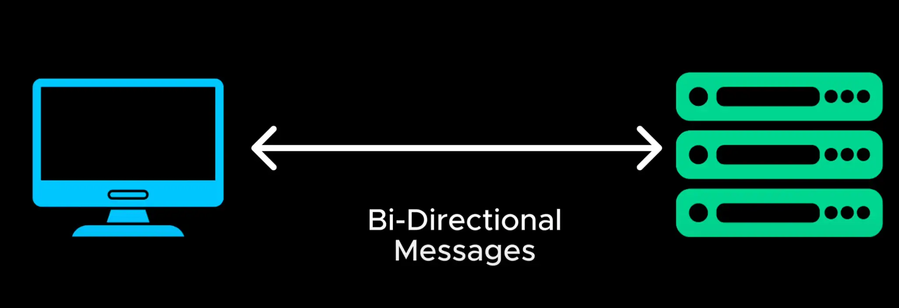
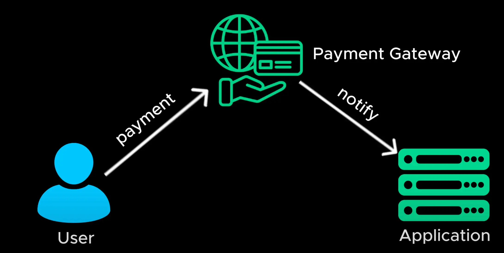

# Web Socket

- Let's move to the next system design concept which can help us build realtime applications

  > Chúng ta hãy chuyển sang khái niệm thiết kế hệ thống tiếp theo có thể giúp chúng ta xây dựng các ứng dụng thời gian thực

- Most web applications use HTTP which follows a request response model
  > Hầu hết các ứng dụng web sử dụng HTTP theo mô hình phản hồi yêu cầu

- the client sends a request the server processes the request and sends a response if the client needs new data it must send another request.

  > > máy khách gửi yêu cầu máy chủ xử lý yêu cầu và gửi phản hồi nếu máy khách cần dữ liệu mới thì phải gửi yêu cầu khác

- This works fine for static web pages but it's too slow and inefficient for real-time applications like live chat applications stock market dashboards or online multiplayer games

  > Điều này hoạt động tốt đối với các trang web tĩnh nhưng quá chậm và không hiệu quả đối với các ứng dụng thời gian thực như ứng dụng trò chuyện trực tiếp, bảng điều khiển thị trường chứng khoán hoặc trò chơi nhiều người chơi trực tuyến

- With HTTP the only way to get real-time update is through frequent polling sending repeated request every few seconds but polling is inefficient because it increases the server load and waste bandwidth as most responses are empty when there is no new data

  > Với HTTP, cách duy nhất để có được cập nhật theo thời gian thực là thông qua việc thăm dò thường xuyên bằng cách gửi yêu cầu lặp lại sau mỗi vài giây nhưng việc thăm dò không hiệu quả vì nó làm tăng tải máy chủ và lãng phí băng thông vì hầu hết các phản hồi đều trống rỗng khi không có dữ liệu mới

- webockets solve this problem by allowing continuous two-way communication between the client and the server over a single persistent connection
  > webockets giải quyết vấn đề này bằng cách cho phép giao tiếp hai chiều liên tục giữa máy khách và máy chủ qua một kết nối liên tục duy nhất

- the client initiates a websocket connection with the server once established the connection remains open the server can push updates to the client at any time without waiting for a request the client can also send messages instantly to the server this enables real-time interactions and eliminates the need for polling

  > máy khách khởi tạo kết nối websocket với máy chủ sau khi thiết lập kết nối vẫn mở máy chủ có thể đẩy các bản cập nhật tới máy khách bất kỳ lúc nào mà không cần chờ yêu cầu máy khách cũng có thể gửi tin nhắn ngay lập tức tới máy chủ điều này cho phép tương tác thời gian thực và loại bỏ nhu cầu thăm dò

- websockets enabled real-time communication between a client and a server but what if a server needs to notify another server when an event occurs

  > websockets cho phép giao tiếp thời gian thực giữa máy khách và máy chủ nhưng nếu máy chủ cần thông báo cho máy chủ khác khi có sự kiện xảy ra thì sao

- For example when a user makes a payment the payment gateway needs to notify your application instantly
  > Ví dụ khi người dùng thực hiện thanh toán, cổng thanh toán cần thông báo ngay cho ứng dụng của bạn

- instead of constantly **polling** an API to check if an event has occurred. Web Hooks allow a server to send an HTTP request to another server as soon as the event occurs
  > thay vì liên tục **thăm dò** một API để kiểm tra xem sự kiện đã xảy ra hay chưa. Webhooks cho phép máy chủ gửi yêu cầu HTTP đến máy chủ khác ngay khi sự kiện xảy ra
