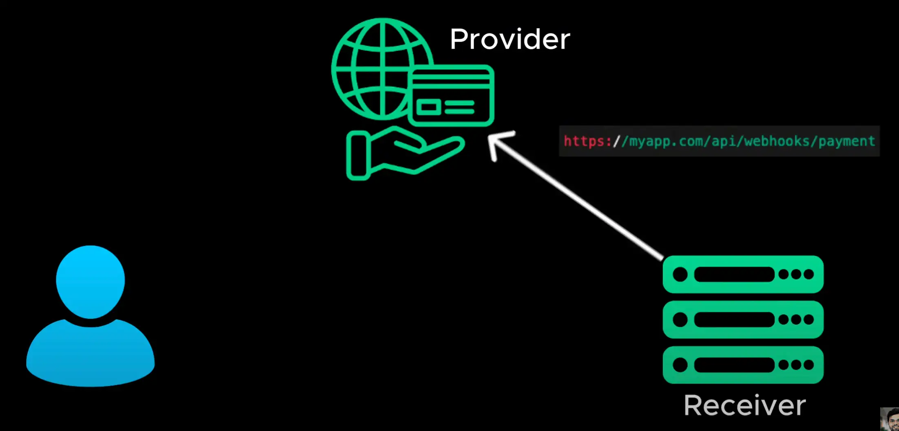
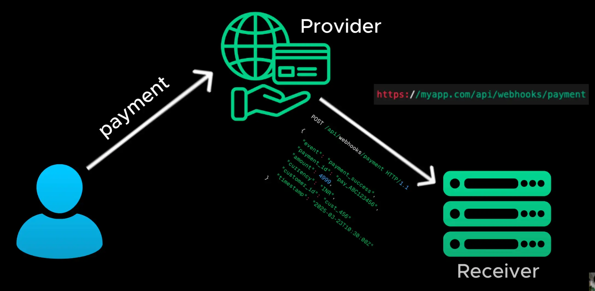

# Web Hooks

- WebHooks allow a server to send an HTTP request to another server as soon as the event occurs

  > WebHooks cho phép máy chủ gửi yêu cầu HTTP đến máy chủ khác ngay khi sự kiện xảy ra

- here is how it works the receiver - for example your app registers a web hook URL with the provider
  > đây là cách nó hoạt động của người nhận - ví dụ ứng dụng của bạn đăng ký URL móc nối web với nhà cung cấp

- when an event occurs the provider sends a HTTP post request to the web hook URL with event details
  > khi một sự kiện xảy ra, nhà cung cấp sẽ gửi yêu cầu đăng HTTP đến URL móc nối web với thông tin chi tiết về sự kiện

- this saves server resources and reduces unnecessary API calls

  > điều này tiết kiệm tài nguyên máy chủ và giảm các cuộc gọi API không cần thiết
