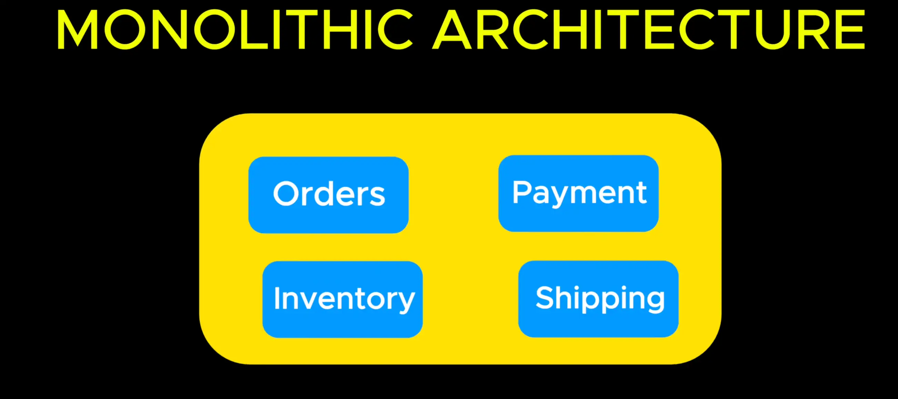

# Monolithic Architechture

- Traditionally application were build using a nomolithic architechture. Wherre all features are inside one large code base.

  >

  

- This setup works fine for small applications but for large scale systems monolisth become hard to manage, scale and deploy

  >

- The solution is to break down your application into smaller independent services called microservices that work together

  >

  
