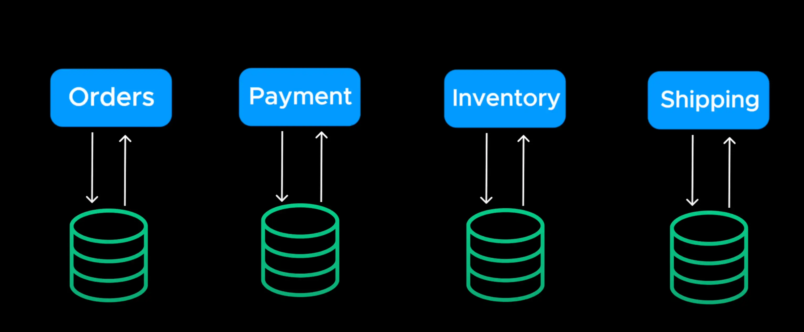
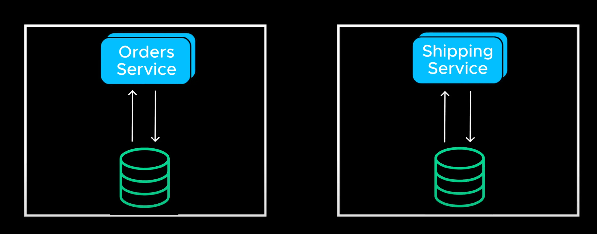

# Microservices

- Each microservices handles a single reponsibility has it own database and logic so it can scale independently (!== dependent)
  > Mỗi dịch vụ siêu nhỏ xử lý một trách nhiệm duy nhất, có cơ sở dữ liệu và logic riêng để có thể mở rộng độc lập

- Communicate with other microservices using APIs or message queues

  >

- This way, services can be scaled and deployed individually without affecting the entire system
  > Theo cách này, các dịch vụ có thể được mở rộng và triển khai riêng lẻ mà không ảnh hưởng đến toàn bộ hệ thống

- However, when multiple micro-services need to communicate direct APIs call's aren't always efficient. This is where Message Queues come in
