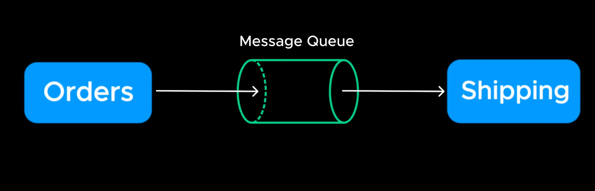
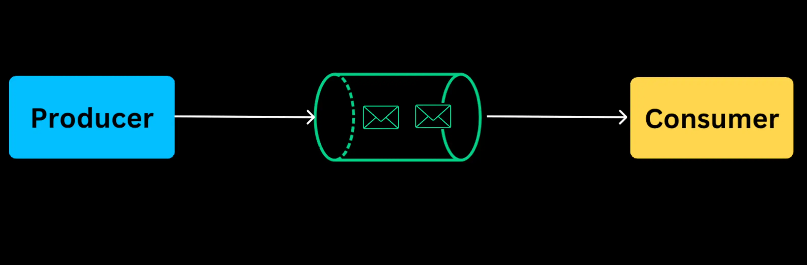

# Message Queues

- Synchronous communication for example waiting for immediate responses doesn't scale well
  > Ví dụ, giao tiếp đồng bộ chờ phản hồi ngay lập tức không mở rộng tốt

- A message queues enable services to communicate asynchronously, allowing request to be processed without blocking other operation
  > Hàng đợi tin nhắn cho phép các dịch vụ giao tiếp không đồng bộ, cho phép xử lý yêu cầu mà không chặn hoạt động khác

- Here is how it work. There is a producer, which place message in the queue.

  >

- The queue temporarily (**tạm thời**) host the message

- The consumer retrieves the message and proccesses it.

- Using message queues we can decouple services and improve the scalability and we can prevent overload on internal services within our system

  > Sử dụng hàng đợi tin nhắn, chúng ta có thể tách rời các dịch vụ và cải thiện khả năng mở rộng và chúng ta có thể ngăn ngừa tình trạng quá tải đối với các dịch vụ nội bộ trong hệ thống của chúng ta

- But how do we prevent overload for the public APIs and services that we deploy for that we use Rate Limiting
