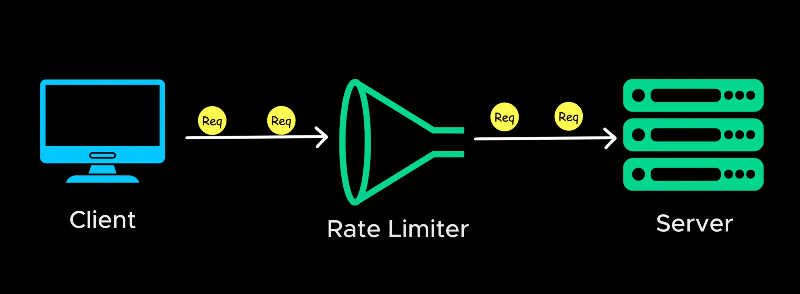
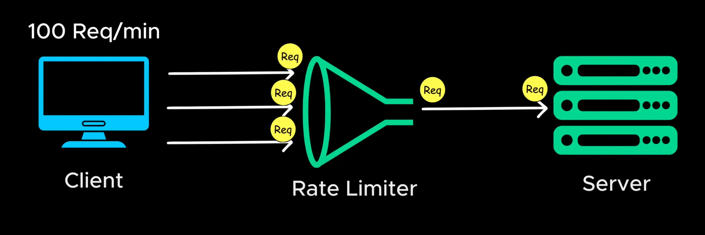

# Rate Limiting

- Imagine a bot starts making thousands of request per second to your website

- Without Restriction, this could crash your servers by consuming all available resource and degrade performance for legitimate users

  > Nếu không có Hạn chế, điều này có thể làm sập máy chủ của bạn bằng cách sử dụng hết tất cả tài nguyên có sẵn và làm giảm hiệu suất của người dùng hợp lệ

- Rate limiting retricts (**hạn chế**) the number of request a client send within a specific (**cụ thể**) time frame
  > Giới hạn tỷ lệ hạn chế số lượng yêu cầu mà khách hàng gửi trong một khung thời gian cụ thể

- Every user or IP Address is assigned a request quota, for example 100 request per minute.

- If the exceed (**vượt quá**) this limit the server blocks additional (**bổ sung**) request temporarily and return an error.
  > Nếu vượt quá giới hạn này, máy chủ sẽ tạm thời chặn các yêu cầu bổ sung và trả về lỗi.

- There are various(**nhiều, nhiều thứ**) rate limiting algorithm

- Some of the popular ones are: fixed window, sliding window, token bucket.

- we don't need implement our own rate limiting system. This can be handle by something called API Gateway
  > chúng ta không cần phải triển khai hệ thống giới hạn tốc độ của riêng mình. Điều này có thể được xử lý bằng một thứ gọi là cổng API
