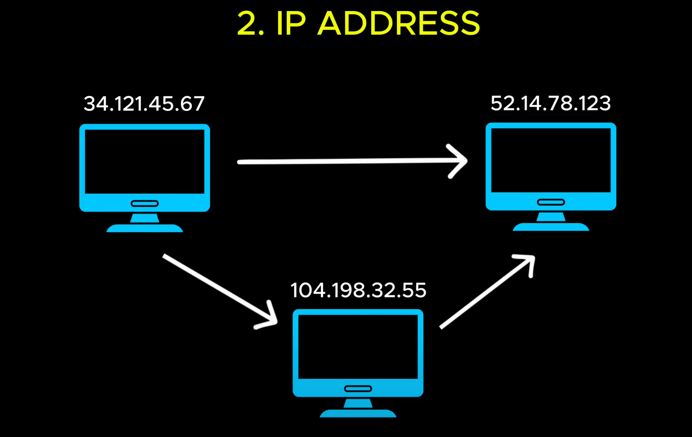

# IP Address (Địa chỉ đinh danh duy nhất)

- "IP" là viết tắt của Internet Protocol – Giao thức Internet.

- On the internet, computers identify (**nhận dạng, xác định**) each other using IP Address, which work like phone number for servers.

- Every public deployed server has a unique (**duy nhat**) IP Address, something like this: 34.120.10.5

- When a client want to interact (**tuong tac**) with a service. It must send request to the correct (**chinh xac, đúng**) IP Address.

- But there's a problem. When we visit a website, we don't tpye is't IP Address. We just enter website name, right?

- Instead of relying on hard to remember (**thay vi dua vao nhung dieu kho nho**) IP Address .

--> Instead (**thay the, dai dien**) , relying (**tin nhiem, tin cay**)

- We use something much more human friendly (**than thien**), domain name.

- But we need a way to map (**ánh xạ**) a domain name to its corresponding (**tuong ung**) IP Address.

- This is where (**nơi**) DNS or Domain Name System come in (**xuất hiện**).

Open: [IP Adrress](./3_dns.md)
