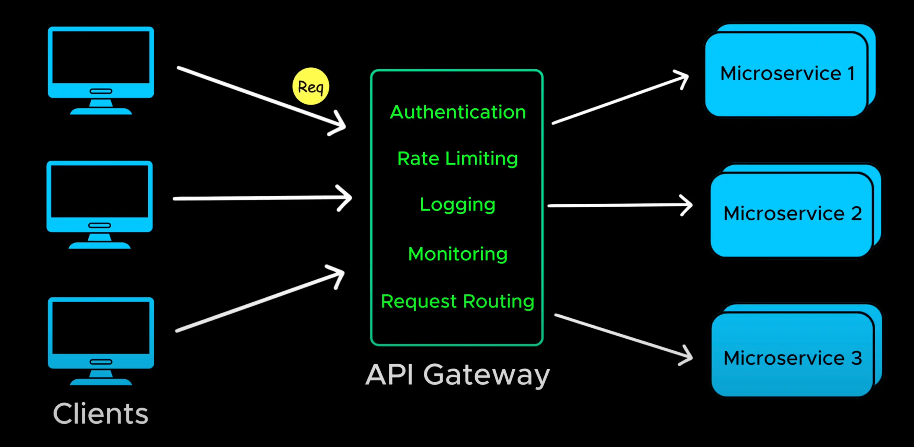
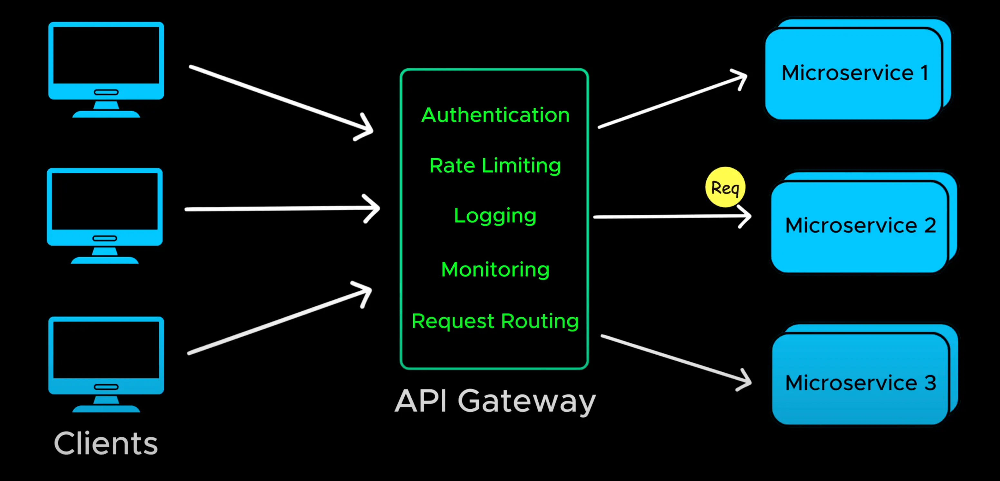
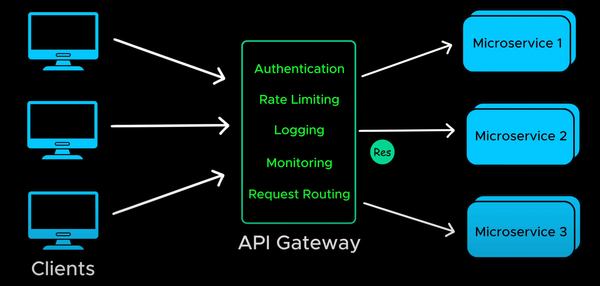
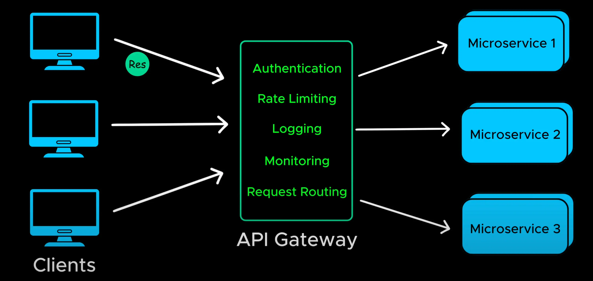

# API Gateway

- An API gateway is centralized service that handles authentication, rate limiting, loging, monitoring, request routing and much more.

- Imagine a microservices-based application with multiple services

- Instead of exposing (**phơi bày**) each service directly, an API Gateway acts as a single entry point for all client request.

-It routes (**định tuyến**) the request to the appropriate (**thích hợp**) microservice

- And the response is sent back through the gateway to the client
  
  

- API gateway simplifies API management and improved scalability and security

  > Cổng API đơn giản hóa việc quản lý API và cải thiện khả năng mở rộng và bảo mật
