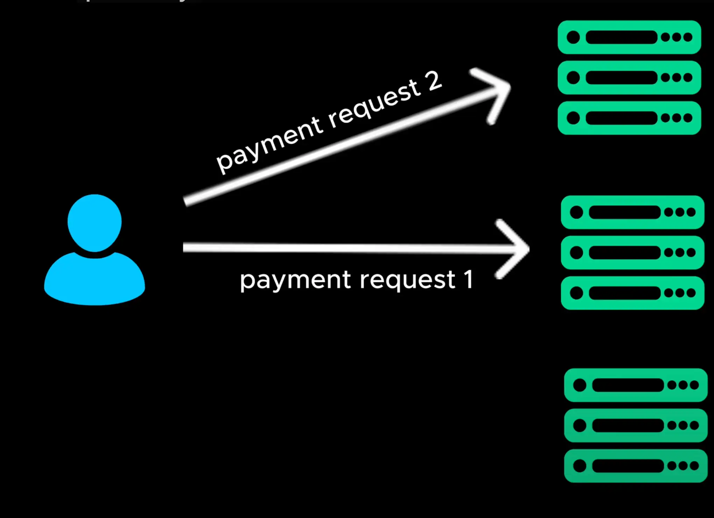
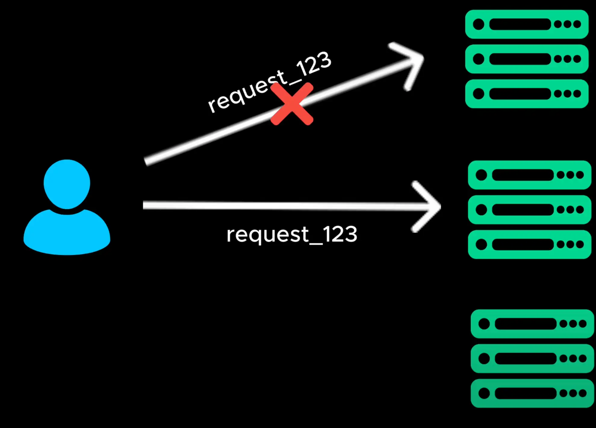
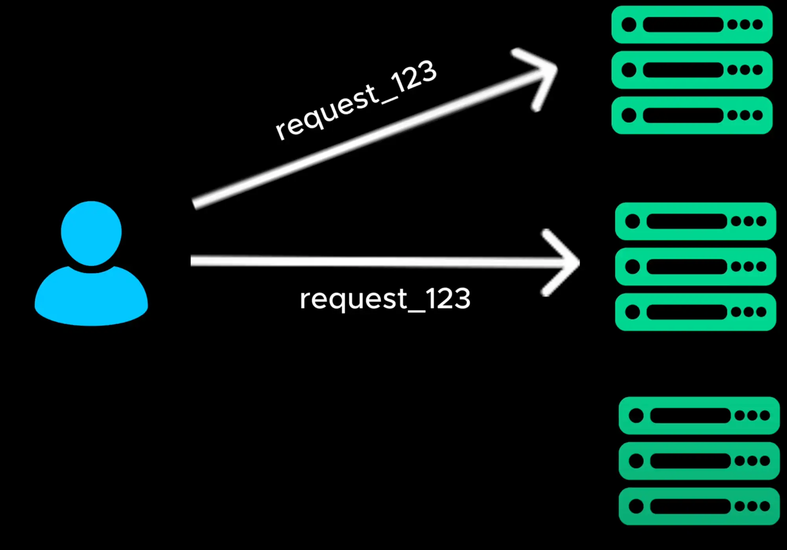

# Idempotency

- In distributed systems network failures and service retries are common. If a user accidentally refreshes a payment page, the system might receive two payment request instead of one
  > Trong các hệ thống phân tán, lỗi mạng và thử lại dịch vụ là phổ biến. Nếu người dùng vô tình làm mới trang thanh toán, hệ thống có thể nhận được hai yêu cầu thanh toán thay vì một

- Idempotency ensure that repeat request produced the same result as if the request was made only once

  > Tính bất biến đảm bảo rằng yêu cầu lặp lại tạo ra kết quả giống như khi yêu cầu chỉ được thực hiện một lần

- Here is how it works. Easy request is assigned a unique ID before processing the system checks if the request has already been handed

  > Đây là cách thức hoạt động. Yêu cầu dễ dàng được gán một ID duy nhất trước khi xử lý hệ thống kiểm tra xem yêu cầu đã được chuyển giao chưa

- If yes, it ignores the duplicate request

- If no, it proccesses the request normally

