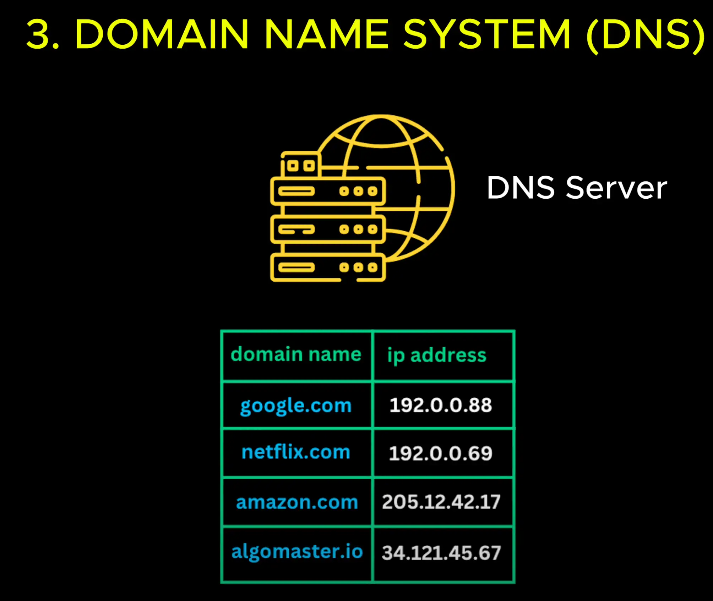

# Domain Name System (DNS)

- It maps easy to remember domain names.

- When you type algomaster.io into to the browser, your computer ask a DNS server for the corresponding (**tương ứng**) IP Address.

- One the DNS Server responds with the IP, your browser uses it to establish (**thiết lập**) the connection (**kết nối**) with the server and make a request.

- You can find the IP Address or any domain name using the ping command. EX: ping youtube.com

- When you visit a web site your request doesn't always ago directly (**trực tiếp**) to the server some time it pass through a proxy or reverse (**ngược**) proxy

Open: [Proxy/Reverse Proxy](./4_proxy.md)
