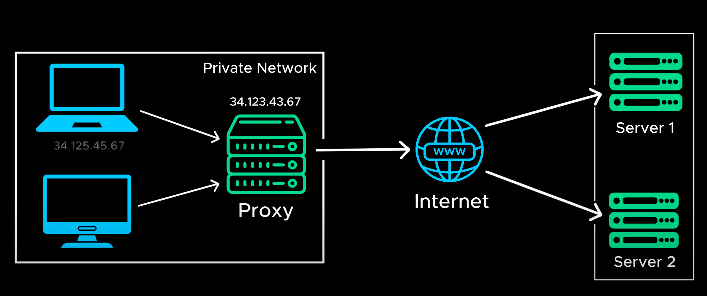
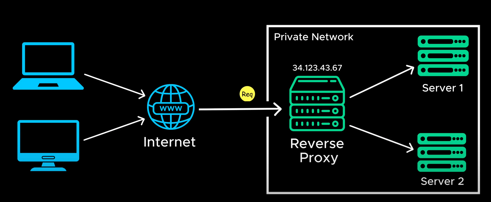
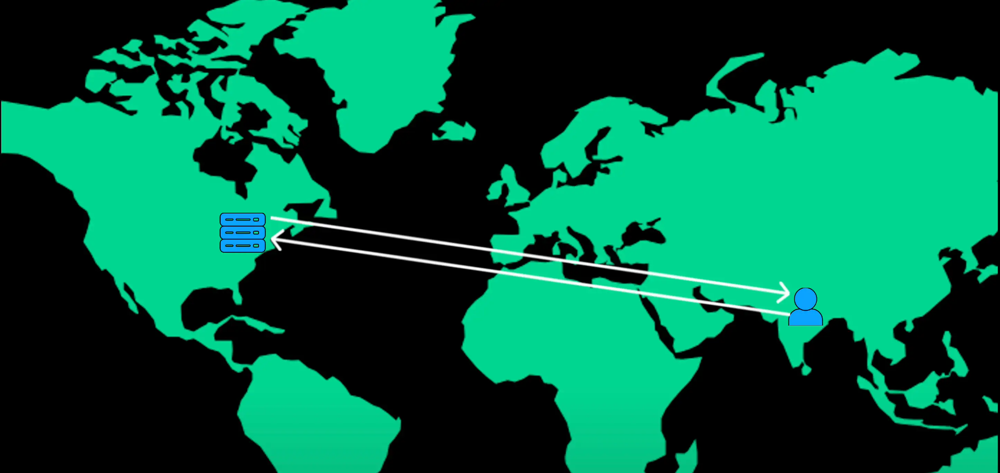

# Proxy or Reverse Proxy

## Proxy

- A proxy server acts (**hoat động**) a middleman (**người đứng giữa**) between your device (**thiết bị**) and the internet.
- When you request a web page. The proxy foward your request to the target (**mục tiêu**) server, retrieves (**lấy lại**) the response and send it back to you
- A proxy server hides your IP Address keeping your location and identity (**danh tính**) private

## Reverse Proxy

- A reverse proxy works other way around (**theo cách khác**).
- It intercepts (**chặn**) the client request and forward to the backend service based on (**dựa trên**) pre-defined (**được xác định trước**) rules (**các quy tắc**).

- Whenever a client communicates (**giao tiếp**) with a server. There is always some delay, one of the biggest (**nguyên nhân**) causes (**gây ra**) of this delay is physical distance (**khoảng cách vật lý**).

- For example if our server is in New York but a user in VietNam sends a request the data has to travel (**di chuyển**) halfway across the world (**nủa vòng trái đất**). And then response has to make the same long trip back. This round trip delay is called latency (**độ trễ**).

- Hight letency can make application fell slow and unresponsive (**không phản hồi**)

Open: [Proxy/Reverse Proxy](./5_latency.md)
