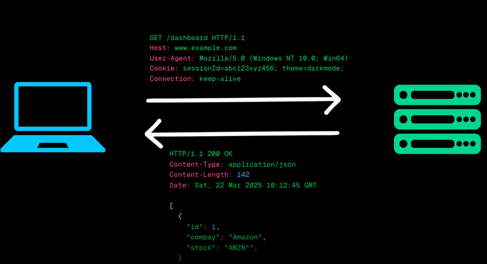
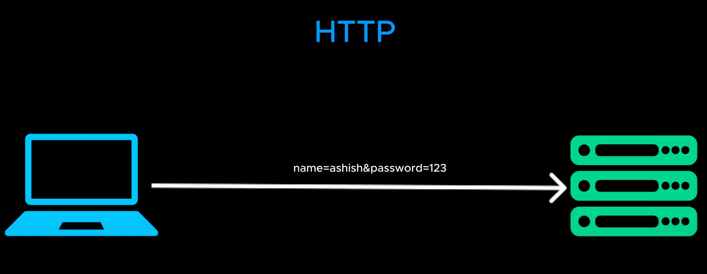
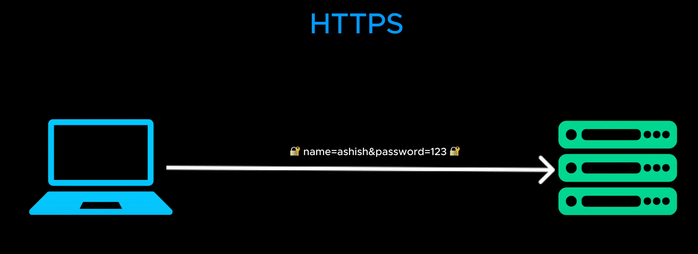

# HTTP/HTTPS

- That's why most URLs start with HTTP or it secure version HTTPs

  

- The client sends a request to the server. This request includes a header containing (**chứa**) details (**chi tiết**) like the request type, browser type and cookies. And sometime a request body which carries additional data like form inputs.

- The server processes the request and responds with a HTTP response either returning the request data or an error message if something goes wrong.

  

- HTTP has a major (**lớn lao**) security law (**luật**). IT sends data in plain text

  

- Modern website use HTTPS. HTTPS encrypts (**mã hóa**) all data using SSL or TLS protocol (**giao thức**). Ensuring (**đảm bảo**) that even if someone intercepts (**đánh chặn**) the request, they can't read and alter (**thay đổi**) it

  

- But clients and servers don't directly (**trực tiếp**) exchange (**trao đổi**) raw (**thô**) HTTP request and response. HTTP is just protocol transferring (**chuyển**) data, but it doesn't define (**xác định**).

- HTTP doesn't define: How request should be structured ? What format response should be in ? How different client should interact with a server ? This is where [APIS](./7_api.md)
