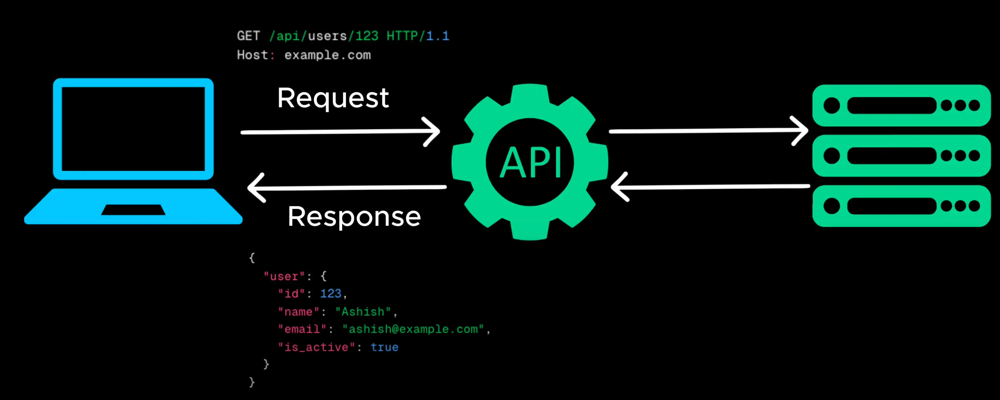

# APIS (Application Programing Interface)

- Think of an API as a middleman that allows (**cho phép**) client to communicate (**giao tiếp**) with servers without (**không phải**) worrying about low-level (**cấp thấp**) details (**chi tiết**)

- A client sends a requests to an API. The API hosted on a server processes (**xử lý**) the request, interacts (**tương tác**) with database or other services (**dịch vụ**) and prepares (**chuẩn bị**) a response

- The API sends back the response in a structured format (**định dạng có cấu trúc**), usually JSON or XML, which the client understands and can display (**hiển thị**).

- There are different API styles to serve (**phuc vu**) different needs, two of the most popular ones are REST and GraphQL

- Among the different api styles REST is the most widely used

Open [REST](./8_rest.md)
