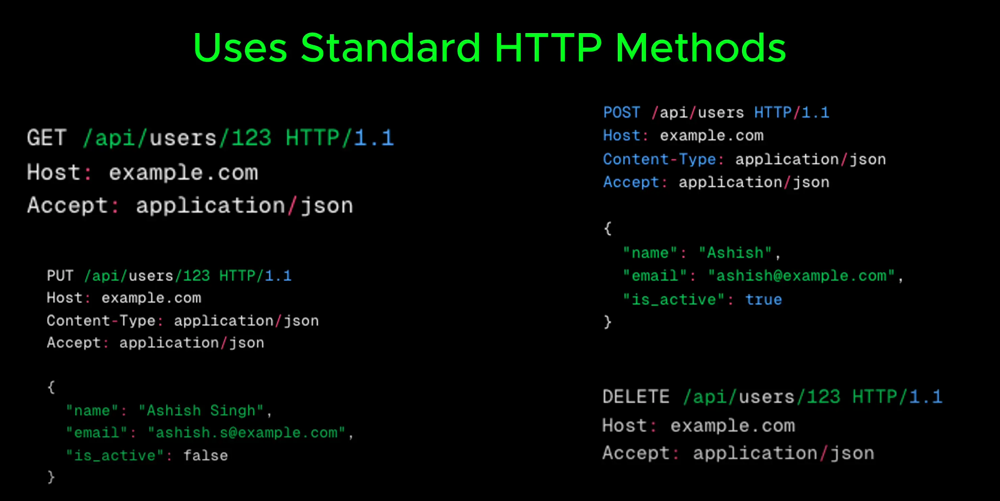

# REST

- A REST API follows (**tuan theo**) a set of rules (**bo quy tac**) that defines (**xac dinh**) how clients and server communicate over (**giao tiep qua**) HTTP in a structured (**co cau truc**) way (**cach**)

- REST is stateless (**khong co trang thai**). Every request independent (**doc lap**). Every thing is create as resource (**tao ra nhu mot tai nguyen**).

  

- Uses standard (**tieu chuan**) HTTP method (**phuong thuc**) like:

  - get: to retrieve data (lay du lieu)
  - post: to create new data
  - pust: to update existing (**hien co**) data
  - delete: to remove data

  

- REST API are great because they are simple, scalable (**co the mo rong**), easy to cast (**dễ đúc**). But they have limitations (**han che**) especially (**dac biet**) when dealing (**xu ly**) with complex (**phuc tap**) data retrieval (**su lay lai**).

- REST endpoints often return more data than needed, leading to (**dan toi**) inefficient (**khong hieu qua**) network uses

  

- To address these challenge, [GraphQL](./9_graphql.md)
  > Để giải quyết những thách thức này, GraphQL
