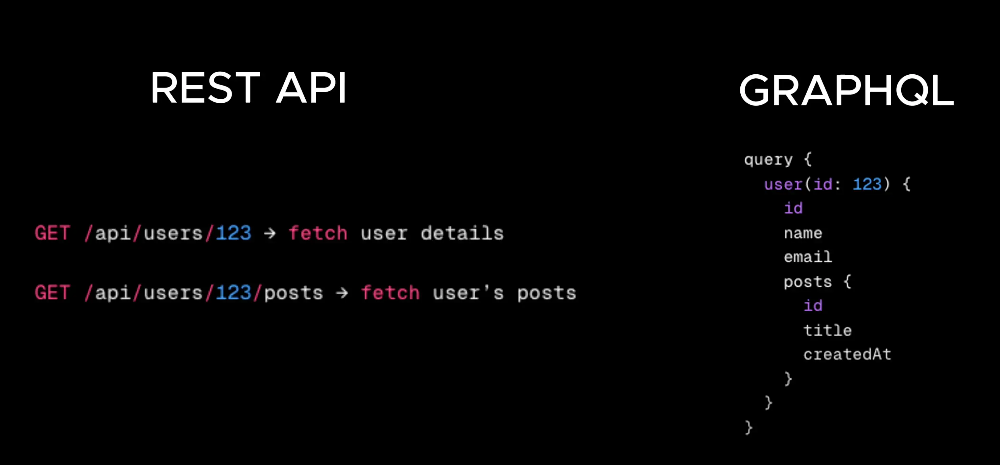

# GraphQL

- GraphQL lets (**cho phep**) client ask for exactly (**chinh xác**) what they need. Nothing more, nothing less

- With GraphQL you can combine (**ket hop**) those request into one and fetch exactly the data you need in a single query.

- The server responds with only the requested fields (**các trường**)

- However, GraphQL comes with trade-off (**sự đánh đổi**). It requires (**đòi hỏi**) more processing (**xử lý**) on the server side and it isn't as easy to cast (**dễ ép kiểu**) as REST

- Now, when a client makes a request they usually want to store or retrieve data. But this brings up another question where is the actual data stored.

  > Bây giờ, khi khách hàng đưa ra yêu cầu, họ thường muốn lưu trữ hoặc truy xuất dữ liệu. Nhưng điều này lại nảy sinh một câu hỏi khác là dữ liệu thực tế được lưu trữ ở đâu.

- If our application deals with small amounts of data we could store it as a variable or as a file and load it in memory

  > Nếu ứng dụng của chúng ta xử lý một lượng nhỏ dữ liệu, chúng ta có thể lưu trữ nó dưới dạng một biến hoặc một file và load trong bộ nhớ

- But modern applications handle massive volumes of data far more than what memory can efficiently handle

  > Nhưng các ứng dụng hiện đại xử lý khối lượng dữ liệu lớn hơn nhiều so với khả năng xử lý hiệu quả của bộ nhớ.

- That's why we need a dedicated server for storing and managing data
  > Đó là lý do tại sao chúng ta cần một máy chủ chuyên dụng để lưu trữ và quản lý dữ liệu

Open [Database](./10_database.md)
