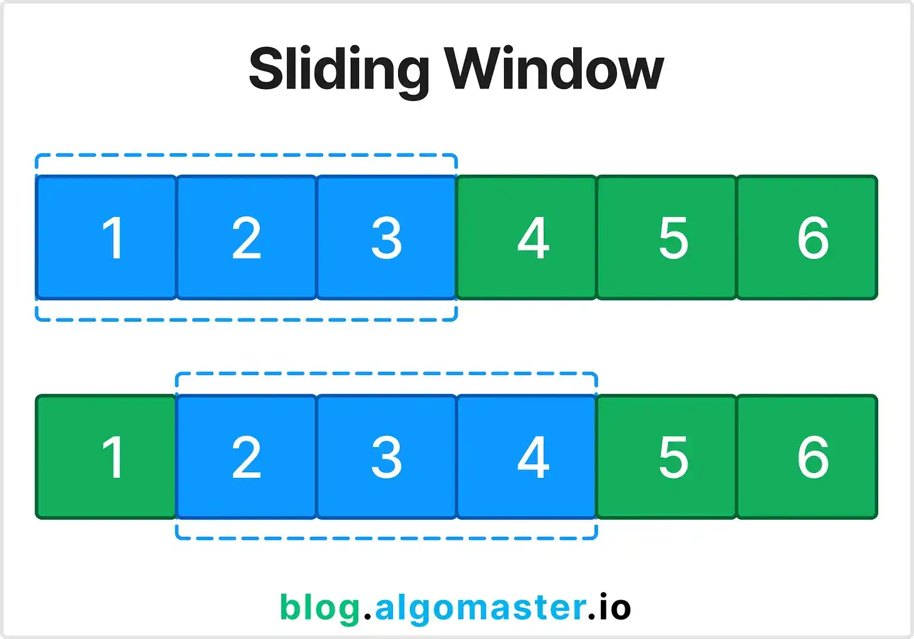

# SLIDING WINDOW - Giải thích chi tiết



## **Ý tưởng cốt lõi**

Sliding Window là kỹ thuật duy trì một "cửa sổ" (window) trượt qua mảng/chuỗi, thay vì kiểm tra tất cả subarray có thể.

**Tại sao hiệu quả?**

- Thay vì tạo lại subarray từ đầu → tận dụng kết quả đã tính
- Giảm từ O(n²) hoặc O(n³) xuống O(n)

---

## **2 loại Sliding Window**

### **1. FIXED SIZE WINDOW**

Window có kích thước cố định k

**Template:**

```python
def fixed_window(arr, k):
    window_sum = sum(arr[:k])  # Khởi tạo window đầu tiên
    max_sum = window_sum

    for i in range(k, len(arr)):
        # Slide: bỏ phần tử đầu, thêm phần tử mới
        window_sum = window_sum - arr[i-k] + arr[i]
        max_sum = max(max_sum, window_sum)

    return max_sum
```

**Ví dụ:** Tìm subarray độ dài 3 có tổng lớn nhất

```
arr = [2, 1, 5, 1, 3, 2], k = 3

Bước 1: [2,1,5] → sum = 8
Bước 2: [1,5,1] → sum = 8-2+1 = 7
Bước 3: [5,1,3] → sum = 7-1+3 = 9
Bước 4: [1,3,2] → sum = 9-5+2 = 6
→ Max = 9
```

### **2. VARIABLE SIZE WINDOW**

Window có kích thước thay đổi tùy theo điều kiện

**Template:**

```python
def variable_window(arr, condition):
    left = 0
    result = 0

    for right in range(len(arr)):
        # Expand: thêm arr[right] vào window
        add_to_window(arr[right])

        # Shrink: thu nhỏ window khi vi phạm điều kiện
        while violates_condition():
            remove_from_window(arr[left])
            left += 1

        # Update result nếu window hợp lệ
        result = max(result, right - left + 1)

    return result
```

---

## **Các pattern phổ biến**

### **Pattern 1: Longest subarray với điều kiện**

```python
# Longest subarray có tổng ≤ target
def longest_sum_le_target(arr, target):
    left = 0
    current_sum = 0
    max_length = 0

    for right in range(len(arr)):
        current_sum += arr[right]

        while current_sum > target:
            current_sum -= arr[left]
            left += 1

        max_length = max(max_length, right - left + 1)

    return max_length
```

### **Pattern 2: Shortest subarray với điều kiện**

```python
# Shortest subarray có tổng ≥ target
def shortest_sum_ge_target(arr, target):
    left = 0
    current_sum = 0
    min_length = float('inf')

    for right in range(len(arr)):
        current_sum += arr[right]

        while current_sum >= target:
            min_length = min(min_length, right - left + 1)
            current_sum -= arr[left]
            left += 1

    return min_length if min_length != float('inf') else 0
```

### **Pattern 3: Count subarrays thỏa mãn**

```python
# Đếm số subarray có tổng = target
def count_subarrays_sum_target(arr, target):
    count = 0

    for start in range(len(arr)):
        current_sum = 0
        for end in range(start, len(arr)):
            current_sum += arr[end]
            if current_sum == target:
                count += 1
            elif current_sum > target:
                break  # Optimization cho mảng dương

    return count
```

---

## **Khi nào dùng từng loại?**

**Fixed Window:**

- "Subarray có độ dài k"
- "Maximum average của k phần tử liên tiếp"
- "Sliding window maximum"

**Variable Window:**

- "Longest subarray thỏa mãn..."
- "Shortest subarray thỏa mãn..."
- "Count subarrays..."

---

## **Lưu ý quan trọng**

**1. Điều kiện Monotonic**

- Window phải có tính chất: nếu window [L,R] vi phạm điều kiện, thì [L,R+1] cũng vi phạm
- Điều này cho phép ta shrink left mà không cần kiểm tra lại

**2. State Management**

- Cần track được state của window (sum, count, frequency, etc.)
- Phải update state khi expand/shrink

**3. Edge Cases**

- Mảng rỗng
- Window size > array size
- Không tìm thấy subarray thỏa mãn

---
