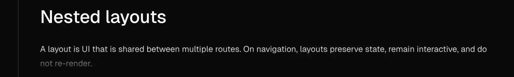

# Prose (Văn bản dạng đoạn văn)

## Screen Reader là gì?

**Screen Reader** (Trình đọc màn hình) là phần mềm hỗ trợ người khiếm thị hoặc người có khó khăn về thị giác sử dụng máy tính và thiết bị di động.

## Cách hoạt động:

### 1. **Chuyển đổi text thành âm thanh**

```
Màn hình hiển thị: "Click here to login"
Screen reader đọc: "Click here to login, button"
```

### 2. **Điều hướng bằng phím tắt**

- `Tab`: Di chuyển giữa các element
- `Enter/Space`: Kích hoạt button/link
- `Arrow keys`: Đọc từng dòng, từng từ
- `H`: Nhảy giữa các heading (h1, h2, h3...)

## Các Screen Reader phổ biến:

### **Desktop:**

- **NVDA** (Windows) - Miễn phí
- **JAWS** (Windows) - Trả phí, phổ biến nhất
- **VoiceOver** (Mac) - Tích hợp sẵn
- **Orca** (Linux) - Mã nguồn mở

### **Mobile:**

- **VoiceOver** (iOS) - Tích hợp sẵn
- **TalkBack** (Android) - Tích hợp sẵn

## Ví dụ thực tế với code của bạn:

### **Không có accessibility:**

```jsx
<button onClick={() => setIsCollapsed(!isCollapsed)}>{isCollapsed ? "More" : "Less"}</button>
```

**Screen reader đọc:** "More, button"

- User không biết button này làm gì
- Không biết trạng thái hiện tại

### **Có accessibility:**

```jsx
<button aria-controls="content-123" aria-expanded={!isCollapsed} onClick={() => setIsCollapsed(!isCollapsed)}>
  {isCollapsed ? "More" : "Less"}
</button>
```

**Screen reader đọc:** "More button, collapsed, controls region"

- User biết đây là button để mở rộng content
- Biết hiện tại đang ở trạng thái collapsed

## Tại sao quan trọng?

### **Thống kê:**

- ~15% dân số thế giới có khuyết tật
- ~2.2 tỷ người có vấn đề về thị giác
- Luật pháp nhiều nước yêu cầu website phải accessible

### **Lợi ích cho developer:**

- **SEO tốt hơn** - Search engine cũng "đọc" như screen reader
- **UX tốt hơn** - Dễ sử dụng cho mọi người
- **Tuân thủ pháp luật** - Tránh kiện tụng

## Demo trải nghiệm:

Bạn có thể thử nghiệm ngay:

### **Windows:**

1. Bật NVDA (tải miễn phí)
2. Đóng mắt, chỉ dùng tai và bàn phím
3. Thử navigate website

### **Mac:**

1. `Cmd + F5` bật VoiceOver
2. Dùng `Control + Option + Arrow` để navigate

### **Mobile:**

1. **iOS:** Settings > Accessibility > VoiceOver
2. **Android:** Settings > Accessibility > TalkBack

Sau khi thử, bạn sẽ hiểu tại sao `aria-controls` và `aria-expanded` lại quan trọng đến vậy! 😊

---

---

Hai thuộc tính `aria-controls` và `aria-expanded` phục vụ cho **accessibility** (khả năng tiếp cận) và có vai trò khác nhau:

## 1. **`aria-controls={contentId}`**

### Mục đích: Tạo mối quan hệ giữa button và nội dung

```jsx
// Button điều khiển element nào?
<button aria-controls="content-123">More</button>
<div id="content-123">...</div> // Element được điều khiển
```

### Lợi ích:

- **Screen readers** biết button này điều khiển element nào
- Khi focus vào button, screen reader có thể announce: "More button, controls region content-123"
- User có thể navigate trực tiếp đến content được điều khiển

## 2. **`aria-expanded={!isCollapsed}`**

### Mục đích: Báo trạng thái mở/đóng hiện tại

```jsx
// Trạng thái hiện tại là gì?
<button aria-expanded={true}>Less</button>   // Đang mở
<button aria-expanded={false}>More</button>  // Đang đóng
```

### Lợi ích:

- Screen reader announce: "More button, collapsed" hoặc "Less button, expanded"
- User biết được trạng thái hiện tại trước khi click
- Tuân thủ chuẩn accessibility cho collapsible content

## 3. **Tại sao cần CẢ HAI?**

### Chúng trả lời các câu hỏi khác nhau:

```jsx
aria-controls="content-123"  // CÁI GÌ được điều khiển?
aria-expanded={false}        // TRẠNG THÁI hiện tại là gì?
```

### Ví dụ thực tế với screen reader:

```jsx
// Khi focus vào button
// Screen reader sẽ đọc:
// "More button, collapsed, controls region content-123"

<button
  aria-controls="content-123" // → "controls region content-123"
  aria-expanded={false} // → "collapsed"
>
  More // → "More button"
</button>
```

## 4. **So sánh khi thiếu một trong hai:**

### ❌ Chỉ có `aria-expanded`:

```jsx
<button aria-expanded={false}>More</button>
// Screen reader: "More button, collapsed"
// Nhưng không biết nó điều khiển cái gì!
```

### ❌ Chỉ có `aria-controls`:

```jsx
<button aria-controls="content-123">More</button>
// Screen reader: "More button, controls region"
// Nhưng không biết trạng thái hiện tại!
```

### ✅ Có cả hai:

```jsx
<button aria-controls="content-123" aria-expanded={false}>
  More
</button>
// Screen reader: "More button, collapsed, controls region content-123"
// Đầy đủ thông tin!
```

Đây là **best practice** cho accessibility - cung cấp đầy đủ context cho người dùng screen reader hiểu được button làm gì và trạng thái hiện tại ra sao.

---

---

```tsx
 className={clsx({
          'max-h-[5lh] overflow-hidden': isCollapsible && isCollapsed,
          '[mask-image:linear-gradient(to_bottom,black_60%,transparent_100%)]':
            isCollapsed,
        })}
```

### Styling đặc biệt:

- max-h-[5lh]: Giới hạn 5 line-heights khi collapsed

- mask-image: Tạo hiệu ứng **fade-out gradient**.

  - example: chữ _not re-render_ trong hình minh họa bị mờ => **fade-out gradient**

  
