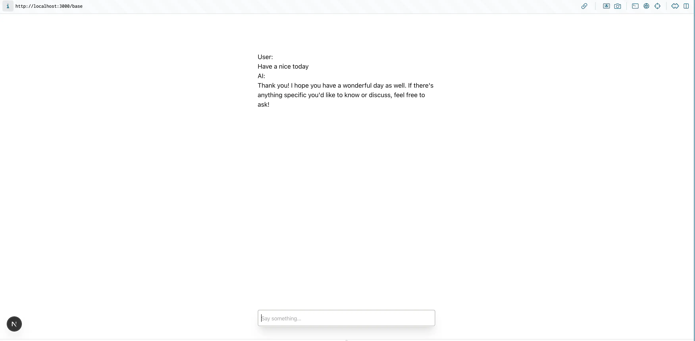
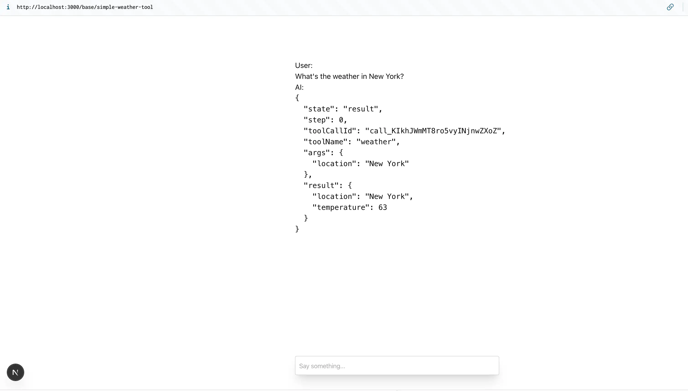
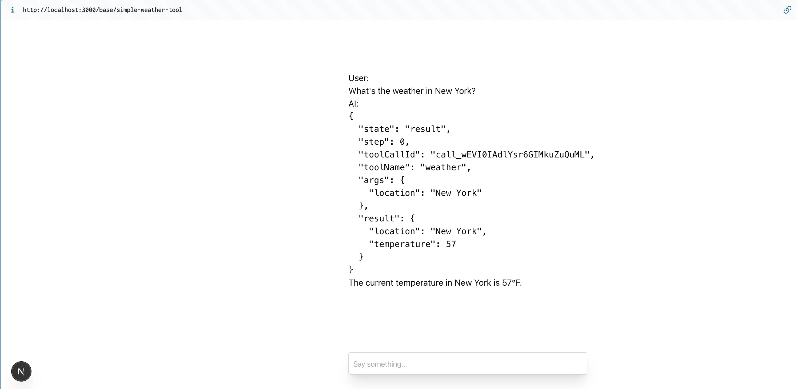
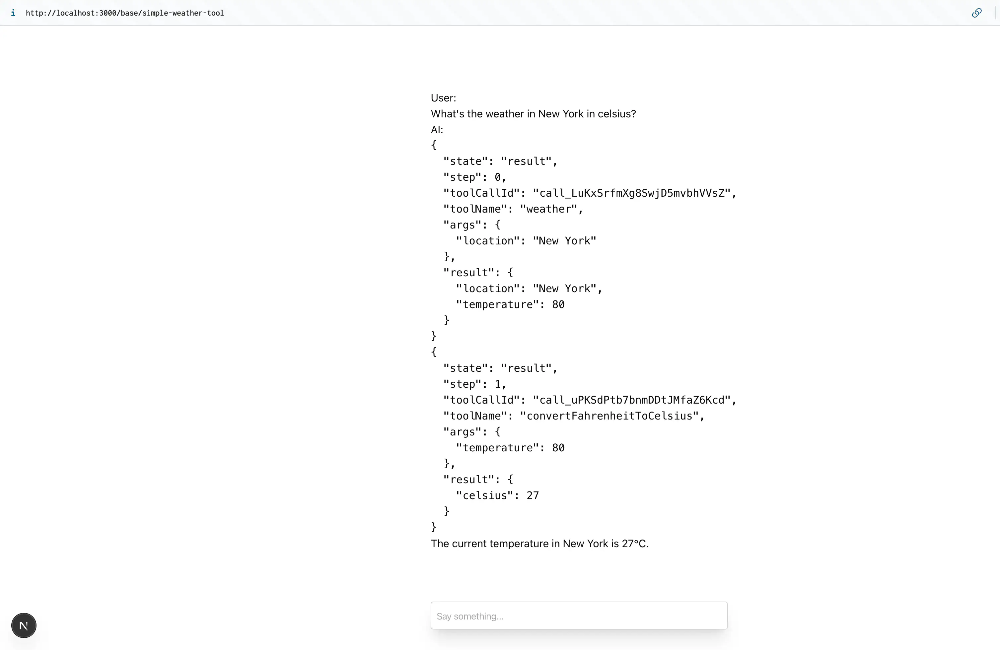

# Explain:

## File: /api/base/route.ts

```ts
import { openai } from "@ai-sdk/openai";
import { streamText } from "ai";

// Allow streaming responses up to 30 seconds
export const maxDuration = 30;

export async function POST(req: Request) {
  const { messages } = await req.json();

  const result = streamText({
    model: openai("gpt-4o"),
    messages,
  });

  return result.toDataStreamResponse();
}
```

1. The `messages` variable contains a history of the conversation between you and the chatbot and provides the chatbot with the necessary context to make the next generation.

   -> `messages` chứa cuộc trò chuyện giữa bạn và chatbot. Và cung cấp ngữ cảnh cho AI biết nên làm gì tiếp theo

2. Call `streamText`, which is imported from the ai package. This function accepts a configuration object that contains a `model` provider (imported from @ai-sdk/openai) and `messages` (defined in step 1)

   -> `streamText` được import từ gói npm ai. Chức năng này chấp nhận một đối tượng có chứa nhà cung cấp mô hình (openai,...) và các tin nhắn của user và chatbot (được xác nhận ở trên). Cài đặt thêm các tính khác xem thêm ở [settings](https://ai-sdk.dev/docs/ai-sdk-core/settings)

3. The `streamText` function returns a `StreamTextResult`. This result object contains the `toDataStreamResponse` function which converts the result to a streamed response object.

   -> Hàm `Streamtext` trả về một `streamtextresult`. Đối tượng kết quả này chứa hàm `TodatastreamResponse` chuyển đổi kết quả thành đối tượng phản hồi được phát trực tuyến.

4. Finally, return the result to the client to stream the response.

   -> Cuối cùng, trả lại kết quả cho khách hàng để truyền phát phản hồi.

---

## File: /base/page.tsx

```tsx
"use client";

import { useChat } from "@ai-sdk/react";

export default function Chat() {
  const { messages, input, handleInputChange, handleSubmit } = useChat({
    api: "/api/base/chat",
  });
  return (
    <div className="flex flex-col w-full max-w-md py-24 mx-auto stretch">
      {messages.map((message) => (
        <div key={message.id} className="whitespace-pre-wrap">
          {message.role === "user" ? "User: " : "AI: "}
          {message.parts.map((part, i) => {
            switch (part.type) {
              case "text":
                return <div key={`${message.id}-${i}`}>{part.text}</div>;
            }
          })}
        </div>
      ))}

      <form onSubmit={handleSubmit}>
        <input
          className="fixed dark:bg-zinc-900 bottom-0 w-full max-w-md p-2 mb-8 border border-zinc-300 dark:border-zinc-800 rounded shadow-xl"
          value={input}
          placeholder="Say something..."
          onChange={handleInputChange}
        />
      </form>
    </div>
  );
}
```

1. The `useChat` hook provides multiple utility functions and state variables:

   - `messages` - the current chat messages (an array of objects with id, role, and parts properties). -> (`messages` - Tin nhắn trò chuyện hiện tại (một mảng các đối tượng có thuộc tính ID, vai trò và các bộ phận).)

   - `input` - the current value of the user's input field.

   - `handleInputChange` and `handleSubmit` - functions to handle user interactions (typing into the input field and submitting the form, respectively).

## Demo



---

---

---

# Enhance (Nâng cao) Your Chatbot with Tools

- While large language models (LLMs) have incredible generation capabilities, they struggle with discrete tasks (e.g. mathematics) and interacting with the outside world (e.g. getting the weather). This is where [tools](https://ai-sdk.dev/docs/ai-sdk-core/tools-and-tool-calling) come in.

  -> Trong khi các mô hình ngôn ngữ lớn (LLM) có khả năng thế hệ đáng kinh ngạc, chúng phải vật lộn với các nhiệm vụ riêng biệt (ví dụ: toán học) và tương tác với thế giới bên ngoài (ví dụ: có thời tiết). Đây là nơi các công cụ đến.

- Tools are actions that an LLM can invoke. The results of these actions can be reported back to the LLM to be considered in the next response.

  -> Các công cụ là hành động mà LLM có thể gọi. Kết quả của những hành động này có thể được báo cáo lại cho LLM để được xem xét trong phản hồi tiếp theo.

- For example, if a user asks about the current weather, without tools, the model would only be able to provide general information based on its training data. But with a weather tool, it can fetch and provide up-to-date, location-specific weather information.

  -> Ví dụ: nếu người dùng hỏi về thời tiết hiện tại, không có công cụ, mô hình sẽ chỉ có thể cung cấp thông tin chung dựa trên dữ liệu đào tạo của nó. Nhưng với một công cụ thời tiết, nó có thể tìm nạp và cung cấp thông tin thời tiết dành riêng cho địa điểm.

## File: /api/base/simple-weather-tool

```tsx
import { openai } from "@ai-sdk/openai";
import { streamText, tool } from "ai";
import { z } from "zod";

export const maxDuration = 30;

export async function POST(req: Request) {
  const { messages } = await req.json();

  const result = streamText({
    model: openai("gpt-4o"),
    messages,
    // ======Start tool======
    tools: {
      weather: tool({
        description: "Get the weather in a location (fahrenheit)",
        parameters: z.object({
          location: z.string().describe("The location to get the weather for"),
        }),
        execute: async ({ location }) => {
          const temperature = Math.round(Math.random() * (90 - 32) + 32);
          return {
            location,
            temperature,
          };
        },
      }),
    },
    // ======End tool======
  });

  return result.toDataStreamResponse();
}
```

1. You import the `tool` function from the `ai` package and `z` from `zod` for schema validation.

2. You define (định nghĩa) a `tools` object with a `weather` tool. This `tool`:

   - Has a `description` that helps the `model` understand when to use it.

     > Có một mô tả giúp mô hình hiểu khi nào nên sử dụng nó

   - Defines parameters using a Zod schema, specifying that it requires a `location` string to execute this tool. The model will attempt to extract this parameter from the context of the conversation. If it can't, it will ask the user for the missing information.

     > Xác định các tham số bằng lược đồ ZOD, chỉ định rằng nó yêu cầu `location` để thực thi công cụ này. Mô hình sẽ cố gắng trích xuất tham số này từ bối cảnh của cuộc trò chuyện. Nếu không, nó sẽ yêu cầu người dùng cho thông tin bị thiếu.

   - Defines an `execute` function that simulates getting weather data (in this case, it returns a random temperature). This is an asynchronous function running on the server so you can fetch real data from an external API.

     > Xác định một chức năng `thực thi (execute)` mô phỏng nhận dữ liệu thời tiết (trong trường hợp này, nó trả về nhiệt độ ngẫu nhiên). Đây là một chức năng không đồng bộ chạy trên máy chủ để bạn có thể tìm nạp dữ liệu thực từ API bên ngoài.

--> Now your chatbot can "fetch" weather information for any location the user asks about. When the model determines it needs to use the weather tool, it will generate a tool call with the necessary parameters. The execute function will then be automatically run, and you can access the results via tool-invocations part that is available on the message.parts array.

> Bây giờ chatbot của bạn có thể "tìm nạp" thông tin thời tiết cho bất kỳ địa điểm nào người dùng yêu cầu. Khi mô hình xác định nó cần sử dụng công cụ thời tiết, nó sẽ tạo ra một cuộc gọi công cụ với các tham số cần thiết. Hàm thực thi sau đó sẽ được tự động chạy và bạn có thể truy cập kết quả thông qua phần nhập công cụ có sẵn trên mảng thông báo.parts.

## File: /base/simple-weather-tool/page.tsx

```tsx
"use client";

import { useChat } from "@ai-sdk/react";

export default function Chat() {
  const { messages, input, handleInputChange, handleSubmit } = useChat({
    api: "/api/base/simple-weather-tool",
  });
  return (
    <div className="flex flex-col w-full max-w-md py-24 mx-auto stretch">
      {messages.map((message) => (
        <div key={message.id} className="whitespace-pre-wrap">
          {message.role === "user" ? "User: " : "AI: "}
          {message.parts.map((part, i) => {
            switch (part.type) {
              case "text":
                return <div key={`${message.id}-${i}`}>{part.text}</div>;
              // ======Start tool======
              case "tool-invocation":
                return <pre key={`${message.id}-${i}`}>{JSON.stringify(part.toolInvocation, null, 2)}</pre>;
              // ======End tool======
            }
          })}
        </div>
      ))}

      <form onSubmit={handleSubmit}>
        <input
          className="fixed dark:bg-zinc-900 bottom-0 w-full max-w-md p-2 mb-8 border border-zinc-300 dark:border-zinc-800 rounded shadow-xl"
          value={input}
          placeholder="Say something..."
          onChange={handleInputChange}
        />
      </form>
    </div>
  );
}
```

## Demo



---

---

---

# Enabling Multi-Step Tool Calls

- You may have noticed that while the tool results are visible in the chat interface, the model isn't using this information to answer your original query. This is because once the model generates a tool call, it has technically completed its generation.

> Bạn có thể nhận thấy rằng trong khi kết quả công cụ có thể hiển thị trong giao diện trò chuyện, mô hình không sử dụng thông tin này để trả lời truy vấn ban đầu của bạn. Điều này là do một khi mô hình tạo ra một cuộc gọi công cụ, về mặt kỹ thuật, nó đã hoàn thành thế hệ của nó.

- To solve this, you can enable multi-step tool calls using the `maxSteps`option in your `useChat` hook. This feature will automatically send tool results back to the model to trigger an additional generation. In this case, you want the model to answer your question using the results from the weather tool.

> Để giải quyết vấn đề này, bạn có thể bật các cuộc gọi công cụ nhiều bước bằng tùy chọn MaxSteps trong Hook USEChat của bạn. Tính năng này sẽ tự động gửi kết quả công cụ trở lại mô hình để kích hoạt một thế hệ bổ sung. Trong trường hợp này, bạn muốn mô hình trả lời câu hỏi của bạn bằng cách sử dụng kết quả từ công cụ thời tiết.

```tsx
"use client";

import { useChat } from "@ai-sdk/react";

export default function Chat() {
  const { messages, input, handleInputChange, handleSubmit } = useChat({
    api: "/api/base/simple-weather-tool",
    // Thêm maxSteps
    maxSteps: 5,
  });

  // ... rest of your component code
}
```

- Head back to the browser and ask about the weather in a location. You should now see the model using the weather tool results to answer your question.

> Quay trở lại trình duyệt và hỏi về thời tiết ở một địa điểm. Bây giờ bạn sẽ thấy mô hình sử dụng kết quả công cụ thời tiết để trả lời câu hỏi của bạn.



- By setting maxSteps to 5, you're allowing the model to use up to 5 "steps" for any given generation. This enables more complex interactions and allows the model to gather and process information over several steps if needed. You can see this in action by adding another tool to convert the temperature from Fahrenheit to Celsius.

> Bằng cách đặt MaxSteps thành 5, bạn cho phép mô hình sử dụng tối đa 5 "bước" cho bất kỳ thế hệ nào. Điều này cho phép các tương tác phức tạp hơn và cho phép mô hình thu thập và xử lý thông tin qua một số bước nếu cần. Bạn có thể thấy điều này trong hành động bằng cách thêm một công cụ khác để chuyển đổi nhiệt độ từ Fahrenheit sang C.

---

- Update your /api/base/simple-weather-tool/route.ts file to add a new tool to convert the temperature from Fahrenheit to Celsius:

```ts
import { openai } from "@ai-sdk/openai";
import { streamText, tool } from "ai";
import { z } from "zod";
// Allow streaming responses up to 30 seconds
export const maxDuration = 30;

export async function POST(req: Request) {
  const { messages } = await req.json();

  const result = streamText({
    model: openai("gpt-4o"),
    messages,
    // ======Start tool======
    tools: {
      weather: tool({
        description: "Get the weather in a location (fahrenheit)",
        parameters: z.object({
          location: z.string().describe("The location to get the weather for"),
        }),
        execute: async ({ location }) => {
          const temperature = Math.round(Math.random() * (90 - 32) + 32);
          return {
            location,
            temperature,
          };
        },
      }),
      // Update tool : convertFahrenheitToCelsius
      convertFahrenheitToCelsius: tool({
        description: "Convert a temperature in fahrenheit to celsius",
        parameters: z.object({
          temperature: z.number().describe("The temperature in fahrenheit to convert"),
        }),
        execute: async ({ temperature }) => {
          const celsius = Math.round((temperature - 32) * (5 / 9));
          return {
            celsius,
          };
        },
      }),
    },
    // ======End tool======
  });

  // Update
  return result.toDataStreamResponse({
    headers: {
      "Content-Type": "application/octet-stream",
      "Content-Encoding": "none",
    },
  });
}
```

- Now, when you ask "What's the weather in New York in celsius?", you should see a more complete interaction:



1. The model will call the weather tool for New York.

2. You'll see the tool result displayed.

3. It will then call the temperature conversion tool to convert the temperature from Fahrenheit to Celsius.

4. The model will then use that information to provide a natural language response about the weather in New York.

This multi-step approach allows the model to gather information and use it to provide more accurate and contextual responses, making your chatbot considerably more useful.

> Cách tiếp cận nhiều bước này cho phép mô hình thu thập thông tin và sử dụng nó để cung cấp các phản hồi chính xác và theo ngữ cảnh hơn, làm cho chatbot của bạn trở nên hữu ích hơn đáng kể.
