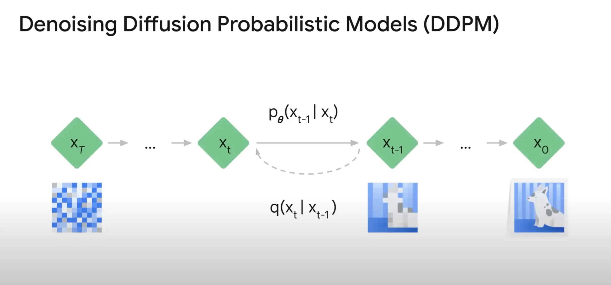

# Advanced: Generative AI for Developers Learning Path

## 01 Introduction to Image Generation

- In this talk we're going to dive into an introduction to Image Generation.

  > Trong bài nói chuyện này chúng ta sẽ đi sâu vào phần giới thiệu về Tạo hình ảnh.

- Specifically, I'll provide an introduction to diffusion models, a family of models that have recently shown tremendous promise in the image generation space.

  > Cụ thể hơn, tôi sẽ giới thiệu về các mô hình khuếch tán, một nhóm mô hình gần đây đã cho thấy triển vọng to lớn trong lĩnh vực tạo hình ảnh.

- With that said, image generation has long been a field of interest, and there are many interesting approaches that you may have heard about.

  > Như đã nói, việc tạo hình ảnh từ lâu đã là một lĩnh vực được quan tâm và có nhiều phương pháp thú vị mà bạn có thể đã nghe đến.

- Now, while many approaches have been implemented for image generation, some of the more promising ones over time have been model families such as variational auto encoders,

  > Hiện nay, trong khi nhiều phương pháp đã được triển khai để tạo hình ảnh, một số phương pháp hứa hẹn hơn theo thời gian là các họ mô hình như bộ mã hóa tự động biến thiên

- which encode images to a compressed size and then decode back to the original size while learning the distribution of the data itself.

  > mã hóa hình ảnh thành kích thước nén và sau đó giải mã trở lại kích thước ban đầu trong khi tìm hiểu cách phân phối dữ liệu.

- Generative adversarial models or Gans, have also been quite popular.

  > Các mô hình đối nghịch tạo sinh hay Gans cũng khá phổ biến.

- These models are really interesting. They actually pit two neural networks against each other.

  > These models are really interesting. They actually pit two neural networks against each other.

- One neural network, the generator creates images, and the other neural network, the discriminator predicts, if the image is real or fake.

  > Một mạng nơ-ron, bộ tạo, tạo ra hình ảnh và mạng nơ-ron còn lại, bộ phân biệt, dự đoán hình ảnh là thật hay giả.

- Over time, the discriminator gets better and better at distinguishing between real and fake, and the generator gets better and better at creating real looking fakes.

  > Theo thời gian, máy phân biệt ngày càng giỏi hơn trong việc phân biệt hàng thật và hàng giả, và máy tạo ngày càng giỏi hơn trong việc tạo ra hàng giả trông giống hàng thật.

- You may have heard the term deepfakes before.

  > Có thể bạn đã từng nghe đến thuật ngữ deepfake.

- And lastly, autoregressive models.

  > Và cuối cùng là mô hình hồi quy tự động.

- These things generate images by treating an image as a sequence of pixels, and the modern approach with auto regressive models actually draws much of its inspiration from how LLM’s, or large language models, handle text.

  > Những thứ này tạo ra hình ảnh bằng cách xử lý hình ảnh như một chuỗi pixel và phương pháp tiếp cận hiện đại với các mô hình hồi quy tự động thực sự lấy cảm hứng phần lớn từ cách LLM hoặc các mô hình ngôn ngữ lớn xử lý văn bản.

- Very interesting. Now, in this talk, this is really going to be the focus and this is one of the newer image generation model families and that is diffusion models.

  > Rất thú vị. Bây giờ, trong bài nói chuyện này, đây thực sự sẽ là trọng tâm và đây là một trong những họ mô hình tạo hình ảnh mới hơn, đó là mô hình khuếch tán.

- Diffusion models draw their inspiration from physics, specifically thermodynamics.

  > Các mô hình khuếch tán lấy cảm hứng từ vật lý, đặc biệt là nhiệt động lực học.

- And while they were first really introduced for Image Generation in 2015, it took a few years for the idea to really take off.

  > Mặc dù chúng thực sự được giới thiệu lần đầu tiên cho Image Generation vào năm 2015, nhưng phải mất vài năm thì ý tưởng này mới thực sự được đón nhận.

- Within the last few years, though, 2020 up until now, we have seen a massive increase of diffusion models in both the research space and now today in the industry space as well.

  > Tuy nhiên, trong vài năm trở lại đây, từ năm 2020 cho đến nay, chúng ta đã chứng kiến ​​sự gia tăng mạnh mẽ của các mô hình khuếch tán trong cả lĩnh vực nghiên cứu và hiện nay là trong lĩnh vực công nghiệp.

- Diffusion models show promise across a number of different use cases. Unconditioned diffusion models, where models have no additional input or instruction, can be trained from images of a specific thing, such as faces, as you can see on the slide here, and it will learn to generate new images of that thing.

  > Các mô hình khuếch tán cho thấy triển vọng trong một số trường hợp sử dụng khác nhau. Các mô hình khuếch tán không điều kiện, trong đó các mô hình không có đầu vào hoặc hướng dẫn bổ sung, có thể được đào tạo từ hình ảnh của một thứ cụ thể, chẳng hạn như khuôn mặt, như bạn có thể thấy trên trang trình bày ở đây và nó sẽ học cách tạo ra hình ảnh mới của thứ đó.

- Another example of unconditioned generation is super resolution, which is really powerful at enhancing low quality images. We also have conditioned generation models and these give us things like text to image where we can generate an image from a text prompt and other things like image-inpainting and text guided image to image where we can remove or add things, we can edit the image itself.

  > Một ví dụ khác về thế hệ không điều kiện là siêu phân giải, thực sự mạnh mẽ trong việc cải thiện hình ảnh chất lượng thấp. Chúng tôi cũng có các mô hình thế hệ có điều kiện và chúng cung cấp cho chúng tôi những thứ như văn bản thành hình ảnh, nơi chúng tôi có thể tạo hình ảnh từ lời nhắc văn bản và những thứ khác như hình ảnh-inpainting và hình ảnh hướng dẫn văn bản thành hình ảnh, nơi chúng tôi có thể xóa hoặc thêm các thứ, chúng tôi có thể chỉnh sửa chính hình ảnh.

  

- Now let's take a little bit of a deeper dove into diffusion models and talk about how do these things actually work.

  > Bây giờ chúng ta hãy đi sâu hơn một chút vào các mô hình khuếch tán và thảo luận về cách thức hoạt động thực sự của chúng.

- As noted on the slide here, the essential idea is to systematically and slowly destroy structure in a data distribution through an iterative forward diffusion process.

  > Như đã lưu ý trên slide này, ý tưởng cốt lõi là phá hủy cấu trúc trong phân phối dữ liệu một cách có hệ thống và chậm rãi thông qua quá trình khuếch tán tiến theo chiều ngược lại.

- Really, this is going to be adding noise iteratively to an image. We then learn a reverse diffusion process that restores structure in the data, yielding a highly flexible and tractable generative model of the data.

  > Trên thực tế, điều này sẽ liên tục thêm nhiễu vào hình ảnh. Sau đó, chúng ta tìm hiểu quá trình khuếch tán ngược giúp khôi phục cấu trúc trong dữ liệu, tạo ra mô hình dữ liệu có tính linh hoạt cao và dễ xử lý.

- In other words, we can add noise to an image iteratively, and we can then train a model that learns how to de-noise an image, thus generating novel images.

  > Nói cách khác, chúng ta có thể thêm nhiễu vào hình ảnh theo cách lặp đi lặp lại, sau đó có thể đào tạo một mô hình để học cách khử nhiễu hình ảnh, do đó tạo ra hình ảnh mới.

  

- So the goal here is that we want to have this model learn to de-noise, to remove noise.

  > Vì vậy, mục tiêu ở đây là chúng ta muốn mô hình này học cách khử nhiễu.

- And in that aspect, then we could start here on the left of the slide.

  > Và theo khía cạnh đó, chúng ta có thể bắt đầu ở đây, bên trái của slide.

  

- And from that pure noise we could have a model that will be able to synthesize a novel image. Now, I know that there's a bit of math notation on this slide.

  > Và từ tiếng ồn thuần túy đó, chúng ta có thể có một mô hình có thể tổng hợp một hình ảnh mới. Bây giờ, tôi biết rằng có một chút ký hiệu toán học trên trang chiếu này.

- So so let's break it down just a little bit. We start with a large dataset of images, but let's just take a single image here shown on the right hand side.

  > Vậy thì hãy chia nhỏ nó ra một chút. Chúng ta bắt đầu với một tập dữ liệu hình ảnh lớn, nhưng hãy chỉ lấy một hình ảnh duy nhất được hiển thị ở bên phải.

  

- Well, we can start this forward diffusion process and we can go from X zero.

  > Vâng, chúng ta có thể bắt đầu quá trình khuếch tán về phía trước này và chúng ta có thể đi từ X bằng không.

- The initial image to X one, the initial image with a little bit of noise added to it.

  > Hình ảnh ban đầu đến X một, hình ảnh ban đầu có thêm một chút nhiễu vào.

- And we can do this over and over again. Iteratively adding more and more noise to the initial image.

> Và chúng ta có thể làm điều này nhiều lần. Lặp đi lặp lại bằng cách thêm ngày càng nhiều nhiễu vào hình ảnh ban đầu.

- Now this distribution we call q and it only depends on the previous step. So if we do this over and over, iteratively adding more noise, we need to think about how many times do we perform that operation and the initial research paper did this 1000 times.

  > Bây giờ chúng ta gọi phân phối này là q và nó chỉ phụ thuộc vào bước trước đó. Vì vậy, nếu chúng ta thực hiện điều này nhiều lần, lặp đi lặp lại thêm nhiễu, chúng ta cần phải suy nghĩ về việc chúng ta thực hiện thao tác đó bao nhiêu lần và bài báo nghiên cứu ban đầu đã thực hiện điều này 1000 lần.

- So ideally, with that number being high enough, 1000 by the end of it, we should reach a state of pure noise. And so by this point, all structure in the initial image is completely gone. We're just looking at pure noise.

  > Vì vậy, lý tưởng nhất là, với con số đó đủ cao, 1000 vào cuối, chúng ta sẽ đạt đến trạng thái nhiễu thuần túy. Và vì vậy, tại thời điểm này, mọi cấu trúc trong hình ảnh ban đầu đều biến mất hoàn toàn. Chúng ta chỉ đang xem xét nhiễu thuần túy.

- It's not too difficult to perform q, to iteratively add more and more noise.

  > Không quá khó để thực hiện q, bằng cách liên tục thêm ngày càng nhiều tiếng ồn.

- The challenging part is how do we go from a noisy image to a slightly less noisy image?

  > Phần khó khăn là làm thế nào để chuyển từ hình ảnh nhiễu sang hình ảnh ít nhiễu hơn?

- And so this will refer to as the reverse diffusion process. And at this stage, every step of the way, every step that we add noise, we also learn the reverse diffusion process.

> Và vì vậy, điều này sẽ được gọi là quá trình khuếch tán ngược. Và ở giai đoạn này, mỗi bước, mỗi bước chúng ta thêm nhiễu, chúng ta cũng học được quá trình khuếch tán ngược.

- That is, we train a machine learning model that takes in as input the noisy image and predicts the noise that's been added to it. Now let's look at that from a slightly different angle.
  > Nghĩa là, chúng ta đào tạo một mô hình học máy lấy hình ảnh nhiễu làm đầu vào và dự đoán nhiễu đã được thêm vào. Bây giờ chúng ta hãy xem xét điều đó từ một góc độ hơi khác.

- We can visualize a single training step of the model here. So we have our initial image x on the left and we sample at a time step to create a noisy image. We then send that through our noisy model with the goal of predicting the noise.

  > Chúng ta có thể hình dung một bước đào tạo duy nhất của mô hình tại đây. Vì vậy, chúng ta có hình ảnh ban đầu x ở bên trái và chúng ta lấy mẫu tại một bước thời gian để tạo ra một hình ảnh nhiễu. Sau đó, chúng ta gửi hình ảnh đó qua mô hình nhiễu của mình với mục tiêu dự đoán nhiễu.

- So the output of the model is the predicted noise, but we just added the noise to this image. We know what it is so we can actually compare that.

  > Vì vậy, đầu ra của mô hình là nhiễu dự đoán, nhưng chúng tôi chỉ thêm nhiễu vào hình ảnh này. Chúng tôi biết nhiễu đó là gì nên chúng tôi thực sự có thể so sánh.

- We can see what is the difference between the model's predicted noise and the actual noise that we added. Now this model is trained similar to most machine learning models that you might be familiar with to minimize that difference.
  > Chúng ta có thể thấy sự khác biệt giữa tiếng ồn dự đoán của mô hình và tiếng ồn thực tế mà chúng ta đã thêm vào. Bây giờ mô hình này được đào tạo tương tự như hầu hết các mô hình học máy mà bạn có thể quen thuộc để giảm thiểu sự khác biệt đó.

- And over time, after seeing enough examples, this model gets very, very good at removing noise from images. And now for the fun part, this is where it gets really cool is we need to think about once we train this model, how do we generate images with it?

  > Và theo thời gian, sau khi xem đủ các ví dụ, mô hình này trở nên rất, rất tốt trong việc loại bỏ nhiễu khỏi hình ảnh. Và bây giờ đến phần thú vị, đây là nơi nó trở nên thực sự thú vị là chúng ta cần phải suy nghĩ khi chúng ta đào tạo mô hình này, làm thế nào chúng ta có thể tạo ra hình ảnh bằng nó?

- Well, it's actually fairly intuitive. We can just start with pure, absolute noise and send that noise through our model that is trained. We then take the output, the predicted noise and subtract it from the initial noise. And if we do that over and over and over again, we end up with a generated image.

  > Vâng, thực ra thì khá trực quan. Chúng ta có thể bắt đầu với nhiễu thuần túy, tuyệt đối và gửi nhiễu đó qua mô hình đã được đào tạo của chúng ta. Sau đó, chúng ta lấy đầu ra, nhiễu dự đoán và trừ nó khỏi nhiễu ban đầu. Và nếu chúng ta làm điều đó nhiều lần, chúng ta sẽ có được một hình ảnh được tạo ra.

- Another way to think about this is that the model is able to learn the real data distribution of images that it's seen and then sample from that learn distribution to create new novel images. Very cool.
  > Một cách khác để nghĩ về điều này là mô hình có thể học được phân phối dữ liệu thực của hình ảnh mà nó nhìn thấy và sau đó lấy mẫu từ phân phối học đó để tạo ra hình ảnh mới lạ. Thật tuyệt.

- As I'm sure we're all aware, there have been many advances in this space in just the last few years. And while many of the exciting new technologies on vertex AI for image generation are underpinned with diffusion models, lots of work has been done to generate images faster and with more control.

  > Như tôi chắc rằng chúng ta đều biết, đã có nhiều tiến bộ trong lĩnh vực này chỉ trong vài năm trở lại đây. Và trong khi nhiều công nghệ mới thú vị về AI đỉnh để tạo hình ảnh được hỗ trợ bởi các mô hình khuếch tán, thì vẫn có rất nhiều công việc được thực hiện để tạo hình ảnh nhanh hơn và kiểm soát tốt hơn.

- Hopefully now, after taking a little bit of a look under the covers into how diffusion models work, you have a bit better intuition as to what's actually going on with these really new innovative model types. We've also seen wonderful results combining the power of diffusion models with the power of LLM’s, or large language models, that can really enable us to create context aware, photorealistic images from a text prompt.

  > Hy vọng là bây giờ, sau khi xem xét kỹ hơn một chút về cách thức hoạt động của các mô hình khuếch tán, bạn sẽ có trực giác tốt hơn một chút về những gì thực sự đang diễn ra với các loại mô hình sáng tạo thực sự mới này. Chúng tôi cũng đã thấy những kết quả tuyệt vời khi kết hợp sức mạnh của các mô hình khuếch tán với sức mạnh của LLM hoặc các mô hình ngôn ngữ lớn, có thể thực sự cho phép chúng tôi tạo ra các hình ảnh có nhận thức về ngữ cảnh, chân thực từ một lời nhắc văn bản.

- One great example of this is Imogen from Google Research. While it's a bit more complicated than what we've talked through in this session, you can see that at its core, it's a composition of an LLM and a few diffusion based models. This is a really exciting space and I'm thrilled to see this wonderful technology make its way into enterprise grade products on Vertex AI
  > Một ví dụ tuyệt vời về điều này là Imogen từ Google Research. Mặc dù phức tạp hơn một chút so với những gì chúng ta đã thảo luận trong phiên này, bạn có thể thấy rằng về bản chất, nó là sự kết hợp của LLM và một vài mô hình dựa trên sự khuếch tán. Đây là một không gian thực sự thú vị và tôi rất vui mừng khi thấy công nghệ tuyệt vời này đi vào các sản phẩm cấp doanh nghiệp trên Vertex AI

---

---

1. What is the name of the model family that draws inspiration from physics and thermodynamics?

   - ❌ Generative adversarial networks
   - ❌ Variational autoencoders
   - ✅ **Diffusion models**
   - ❌ Autoregressive models

2. What is the goal of diffusion models?

   - ✅ **To learn the latent structure of a dataset by modeling the way in which data points diffuse through the latent space**
   - ❌ To encode images to a compressed size, then decode back to the original size
   - ❌ To pit two neural networks against each other
   - ❌ To generate images by treating an image as a sequence of vectors

3. What is the process of forward diffusion?

   - ❌ Start with a noisy image and remove noise iteratively
   - ✅ Start with a clean image and add noise iteratively
   - ❌ Start with a clean image and add noise randomly
   - ❌ Start with a noisy image and remove noise randomly

4. What are some challenges of diffusion models?

   - ✅ **All of the challenges listed are correct.**
   - They can be difficult to control.
   - They can be computationally expensive to train.
   - They can generate images that are not realistic.

5. Which process involves a model learning to remove noise from images?
   - ✅ Reverse diffusion
   - ❌ GANs
   - ❌ Sampling
   - ❌ Forward diffusion
