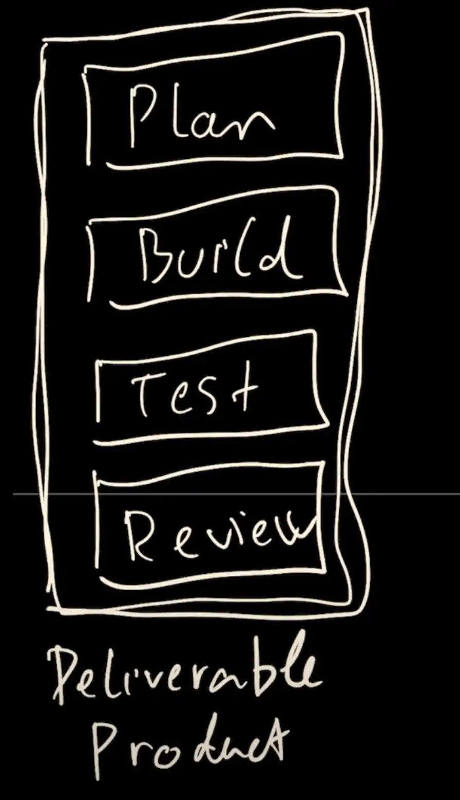
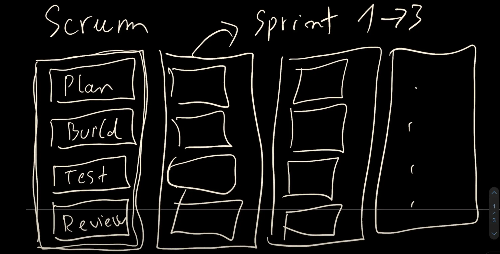
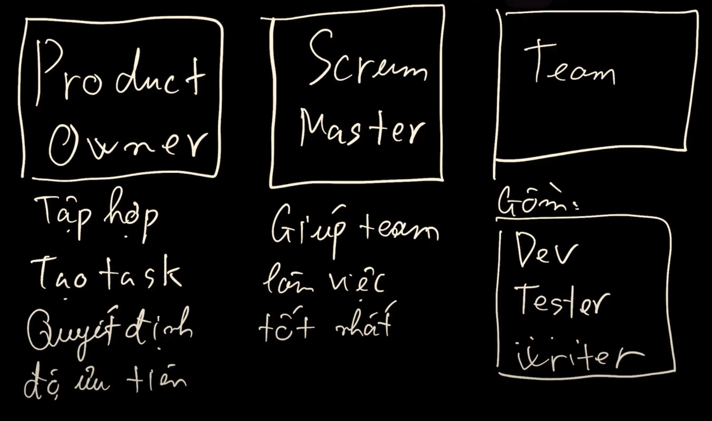
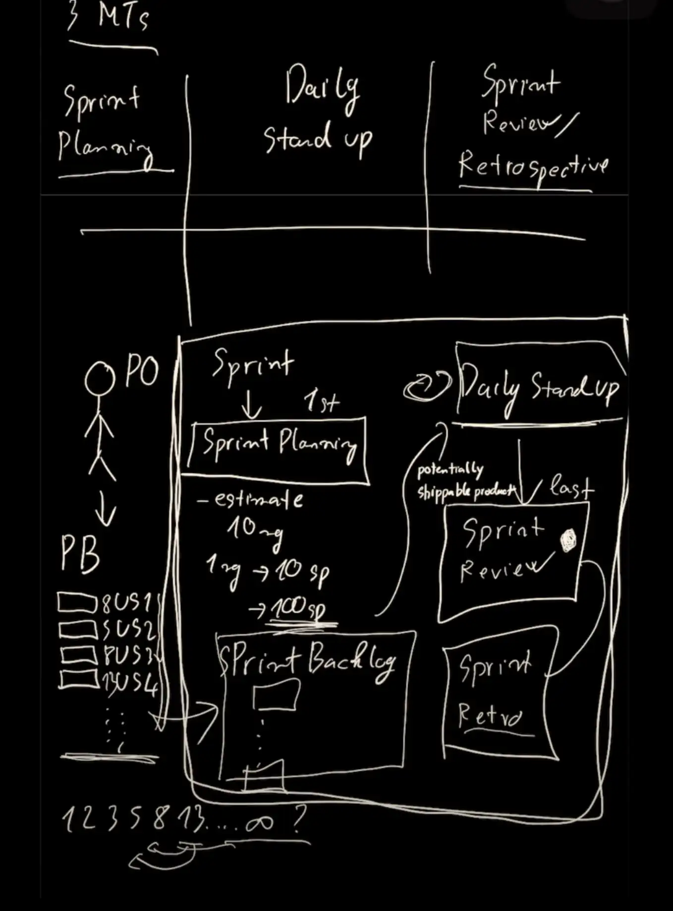

## **Scrum là gì?**

Scrum là một quy trình làm việc trong phần mềm, đặt ra các quy luật để có được một quy trình làm việc hiệu quả. Nó là một cách triển khai của **Agile**, hay còn gọi là một tuyên ngôn trong việc phát triển phần mềm toàn diện.

## **So sánh Scrum và Waterfall**

- **Waterfall:** Là một quy trình tuần tự với các bước riêng biệt: Lập kế hoạch (Planning), Xây dựng (Build), Kiểm thử (Test), Đánh giá (Review), Phát hành (Release). Vấn đề là khi phát hiện lỗi ở các bước sau (ví dụ: trong Kiểm thử), việc quay lại các bước trước đó (ví dụ: Lập kế hoạch) sẽ tốn rất nhiều thời gian (có thể mất 6 tháng đến 1 năm). Người dùng chỉ có thể sử dụng sản phẩm khi mọi thứ đã hoàn thành.
- **Scrum:** Vẫn có các bước Lập kế hoạch, Xây dựng, Kiểm thử, Đánh giá, Phát hành nhưng được thực hiện theo từng **"sprint"** lặp đi lặp lại. Mỗi sprint tạo ra một **"sản phẩm có thể bàn giao được"** (usable product), thường kéo dài từ 1 đến 3 tuần. Khách hàng có thể thấy sản phẩm sau mỗi sprint (ví dụ: mỗi 2 tuần) và đưa ra phản hồi sớm.

## **Các vai trò trong Scrum**

- **Product Owner (Chủ sở hữu sản phẩm):** Chịu trách nhiệm tập hợp yêu cầu của khách hàng và dự án, tạo ra các nhiệm vụ và quyết định độ ưu tiên của chúng.
- **Scrum Master:** Hỗ trợ nhóm làm việc hiệu quả nhất, đảm bảo mọi người đúng giờ, và bảo vệ nhóm khỏi các yếu tố gây xao nhãng.
- **Team (Nhóm phát triển):** Bao gồm Nhà phát triển (Dev), Kiểm thử viên (Tester), Nhà thiết kế (Designer), Người viết nội dung (Content Writer), v.v. Các thành viên thường có khả năng **đa năng** (cross-functional), nghĩa là họ có thể thực hiện một số khía cạnh công việc của người khác.

## **Các thành phần quan trọng của Scrum**

- **Product Backlog:** Chứa tất cả các nhiệm vụ cần thực hiện, được thông báo bởi Product Owner.
- **User Stories (Câu chuyện người dùng):** Là cách thể hiện một nhiệm vụ, được viết theo công thức "Với tư cách là một [người dùng], tôi cần [cái gì đó] để tôi có thể [làm gì đó]".
- **Sprint Backlog:** Chứa các User Story đã được chọn để thực hiện trong một sprint cụ thể.
- **Burn-down Chart (Biểu đồ giảm tốc):** Một biểu đồ cho thấy số lượng nhiệm vụ hoặc **Story Points** còn lại trong một sprint. Story Points càng lớn thì công việc càng nhiều.

## **Các cuộc họp trong Scrum**

- **Sprint Planning (Lập kế hoạch Sprint):** Thảo luận và ước tính Story Points cho các User Story sẽ được đưa vào Sprint Backlog. Diễn ra trước khi sprint bắt đầu.
- **Daily Stand-up (Scrum hàng ngày):** Một cuộc họp ngắn hàng ngày để đồng bộ hóa thông tin của tất cả mọi người trong nhóm. Các thành viên chia sẻ: hôm qua đã làm gì, hôm nay sẽ làm gì, có vướng mắc gì không và có cần hỗ trợ gì không.
- **Sprint Review (Đánh giá Sprint):** Thể hiện những gì đã làm được trong sprint cho Product Owner để họ xem trạng thái và đưa ra phản hồi.
- **Sprint Retrospective (Cải tiến Sprint):** Thảo luận về quy trình làm việc, tìm ra điểm tốt để phát huy, điểm chưa tốt để cải thiện, và những điều nên có trong tương lai.

## **Quy trình làm việc tổng thể (Full-flow)**

Yêu cầu của khách hàng được chuyển đến Product Owner, người sẽ tạo ra Product Backlog (chứa User Stories). Mỗi sprint bắt đầu bằng Sprint Planning (ước tính Story Points, chọn nhiệm vụ cho Sprint Backlog). Trong suốt sprint, các cuộc họp Daily Stand-up diễn ra hàng ngày để cập nhật tiến độ. Khi sprint kết thúc, có Sprint Review (demo sản phẩm) và Sprint Retrospective (cải thiện quy trình). Sau mỗi sprint, có một **"sản phẩm có thể sẵn sàng bàn giao"** (potentially shippable product).

## **Ước tính trong Scrum**

User Story được chấm điểm bằng cách sử dụng dãy Fibonacci (1, 2, 3, 5, 8, 13...). Nếu một User Story có điểm quá lớn (ví dụ: >13), cần chia nhỏ thành các nhiệm vụ nhỏ hơn. Việc ước tính liên quan đến việc so sánh nhiệm vụ cần ước tính với các nhiệm vụ tương tự đã từng làm trước đây, xem xét độ phức tạp và thời gian, không chỉ dựa vào tên nhiệm vụ.

## Nguồn tham khảo:

- [Ông dev YTB](https://www.youtube.com/watch?v=KmOKQS9u-90&t=349s)
