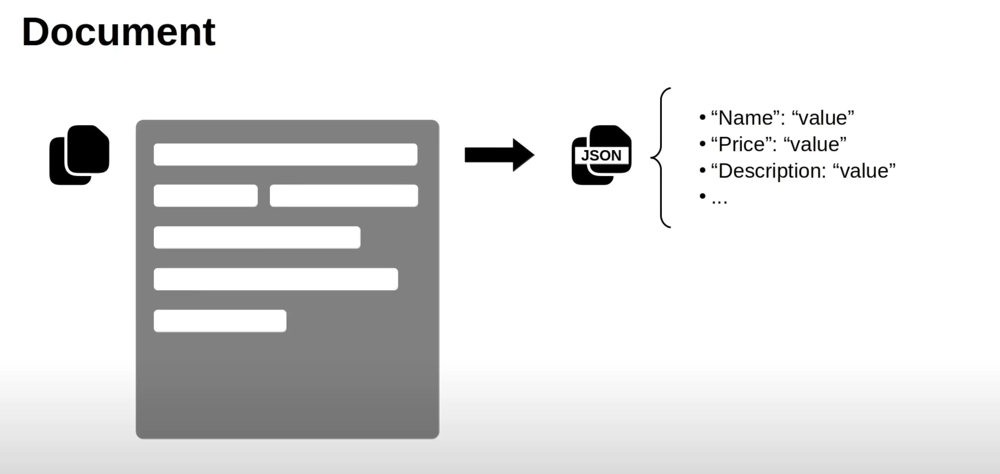

Nếu bạn có một tài liệu PDF và muốn **insert nội dung vào Elasticsearch**, bạn phải trải qua các bước sau:

---

### ✅ **Bước 1: Trích xuất nội dung từ PDF**

Elasticsearch không hiểu file PDF trực tiếp. Bạn cần dùng công cụ như:

- `PyMuPDF` (nhanh, chính xác)
- `pdfminer.six` (chuẩn, hỗ trợ layout)
- `Tika` (dễ dùng, có REST API)
- `Textract` (đa dụng, dùng cho nhiều định dạng)

**Ví dụ (Python dùng PyMuPDF):**

```python
import fitz  # PyMuPDF

doc = fitz.open("example.pdf")
text = ""
for page in doc:
    text += page.get_text()
```

---

### ✅ **Bước 2: Đưa nội dung vào Elasticsearch**

Giả sử bạn đã có `text`, giờ chỉ cần insert như document bình thường:

```python
from elasticsearch import Elasticsearch

es = Elasticsearch("http://localhost:9200")

doc = {
    "filename": "example.pdf",
    "content": text
}

es.index(index="documents", document=doc)
```

---

### 🧠 **Mẹo hay**

- Có thể **chia PDF thành các đoạn nhỏ** (theo trang, đoạn) để search chính xác hơn.
- Dùng **`attachment` processor** trong **Ingest Pipeline** nếu muốn Elasticsearch **tự trích xuất nội dung từ PDF**, nhưng cần cài **`ingest-attachment` plugin** và encode file dạng base64.

---

Cần mình viết ví dụ đầy đủ theo cách nào? (Python extract rồi insert, hay dùng Elasticsearch pipeline tự xử lý file?) Mình có thể [viết script Python đầy đủ cho bạn](f) hoặc [tìm giải pháp tối ưu theo kiến trúc bạn đang dùng](dr).

---

---

Dựa vào hình bạn gửi, ta rút ra lý thuyết, công dụng và thực hành liên quan đến **document**, **index**, và **mapping** trong Elasticsearch như sau:

---

## 🧠 **Lý thuyết**

### 1. **Document**

- Là **đơn vị dữ liệu nhỏ nhất** được lưu trong Elasticsearch.
- Là một **object JSON**, ví dụ:

  ```json
  {
    "created_on": "2025-07-05",
    "text": "Elasticsearch is a search engine",
    "title": "Intro to Elasticsearch"
  }
  ```

### 2. **Index**

- Tương tự như **table** trong database SQL.
- Chứa nhiều document có cùng **structure (schema)**.

### 3. **Mapping**

- Là **schema** của index.
- Xác định **kiểu dữ liệu** cho từng field, ví dụ:

  - `created_on`: `date`
  - `text`, `title`: `text` (được phân tích để search toàn văn)

- Có thể tạo mapping:

  - **Tự động (automatic)**: Elasticsearch tự đoán kiểu khi bạn insert document.
  - **Thủ công (manual)**: Bạn chỉ định rõ kiểu dữ liệu từng field.

---

## 🧩 **Công dụng của Mapping**

- Kiểm soát **kiểu dữ liệu chính xác** (tránh lỗi khi query hoặc phân tích dữ liệu).
- Tùy chỉnh cách **Elasticsearch phân tích văn bản** (analyzer, tokenizer).
- Giúp **tối ưu hóa tìm kiếm** và **tiết kiệm dung lượng lưu trữ**.

---

## 🛠️ **Thực hành: tạo index thủ công với mapping**

### ✅ 1. Mapping thủ công:

```bash
curl -X PUT "localhost:9200/my_index" -H 'Content-Type: application/json' -d'
{
  "mappings": {
    "properties": {
      "created_on": { "type": "date" },
      "text":       { "type": "text" },
      "title":      { "type": "text" }
    }
  }
}'
```

---

### ✅ 2. Insert document:

```bash
curl -X POST "localhost:9200/my_index/_doc" -H 'Content-Type: application/json' -d'
{
  "created_on": "2025-07-05",
  "text": "Elasticsearch is a distributed search engine.",
  "title": "Quick Start Guide"
}'
```

---

### ✅ 3. Truy vấn (search theo text):

```bash
curl -X GET "localhost:9200/my_index/_search" -H 'Content-Type: application/json' -d'
{
  "query": {
    "match": {
      "text": "search engine"
    }
  }
}'
```

---

Nếu bạn cần mình viết script Python để tạo index với mapping và insert document (từ PDF hoặc nguồn khác), mình có thể [viết mẫu cụ thể](f) giúp bạn áp dụng ngay trong dự án.
