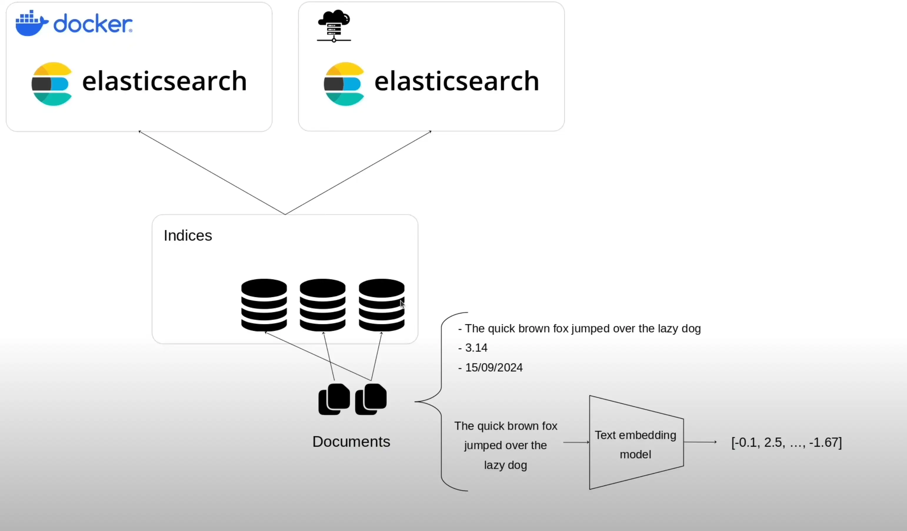

## ✅ 1. **Core Khái niệm (phải hiểu kỹ)**

- **Cluster, Node, Index, Shard, Document**

  - `Cluster`: tập hợp các node hoạt động như một hệ thống tìm kiếm duy nhất.
  - `Node`: một instance của ES chạy trong JVM.
  - `Index`: tương đương 1 database.
  - `Shard`: phân mảnh của index để scale.
  - `Document`: đơn vị dữ liệu nhỏ nhất (JSON object).

- **Mapping**

  - Tương tự schema của RDBMS: định nghĩa kiểu dữ liệu cho field (string, integer, date,...).

- **Inverted Index**

  - Cấu trúc dữ liệu cốt lõi giúp ES tìm kiếm nhanh.
  - ES không lưu dữ liệu như database truyền thống; nó lưu các token của text (full-text search engine).

---

## ✅ 2. **Tìm kiếm (Search)**

- **Match vs Term query**

  - `match`: phân tích (analyzed) dữ liệu (dùng cho full-text).
  - `term`: không phân tích (dùng cho keyword, id,...).

- **Bool Query**

  - Kết hợp nhiều điều kiện: `must`, `should`, `must_not`.

- **Filtering vs Querying**

  - `filter`: không tính điểm (\_score), nhanh hơn, cache được.
  - `query`: dùng để tính điểm liên quan (\_score), dùng khi cần ranking.

---

## ✅ 3. **Indexing (Ghi dữ liệu)**

- Dữ liệu gửi vào dạng JSON qua REST API.

- Ghi dữ liệu có thể qua:

  - `POST /index/_doc/`
  - `PUT /index/_doc/id`

- **Bulk API**: rất quan trọng khi cần insert/update nhiều document 1 lúc.

---

## ✅ 4. **Cấu trúc dữ liệu**

- Field types: `text`, `keyword`, `date`, `integer`, `boolean`,...
- `text`: dùng để phân tích và tìm kiếm (full-text).
- `keyword`: dùng cho sort, filter, aggregation.

---

## ✅ 5. **Aggregation (Tương tự GROUP BY)**

- Dùng để thống kê, đếm, phân nhóm.
- Các loại phổ biến:

  - `terms`: đếm theo giá trị field.
  - `range`: phân chia theo khoảng.
  - `date_histogram`: thống kê theo thời gian.

---

## ✅ 6. **Hiệu suất & Tối ưu**

- **Shard sizing**: quá nhiều shard làm chậm query → giữ shard < 50GB là hợp lý.
- **Avoid wildcard** ở đầu (`*abc`) → rất tốn tài nguyên.
- Dùng `filter context` thay vì `query` nếu không cần ranking.

---

## ✅ 7. **Công cụ đi kèm**

- **Kibana**: giao diện web để query, visualize.
- **Logstash / Beats**: pipeline để đưa log/data vào ES.

---

## ✅ Bonus: Những thứ nên biết sau khi vững core

- **Alias**: tên tắt của index, giúp dễ routing.
- **Index lifecycle management (ILM)**: quản lý dữ liệu cũ, xoá theo thời gian.
- **Security & Role**: user, permission khi dùng trong production.

---

Tóm gọn: nếu bạn nắm vững **cấu trúc index → mapping → search → filter → aggregation**, thì bạn đã có thể dùng Elasticsearch thành thạo trong 80% các use case thực tế.

---

- Tìm kiếm linh hoạt và chấp nhận nhiều loại dữ liệu: văn bản thuần túy, number, date, vector-db
- Ứng dụng vào làm: công cụ tìm kiếm mạnh mẽ (Search system) , hệ thống đề xuất thông minh (Recommendation system), RAG system

//
