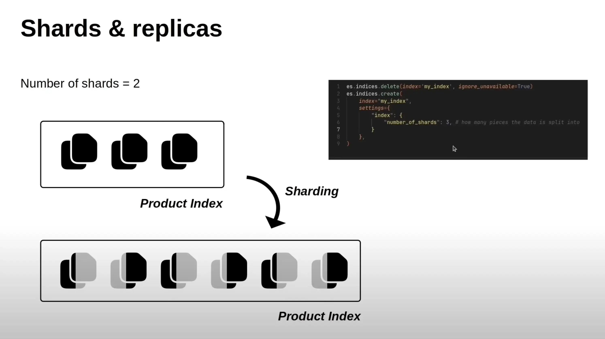
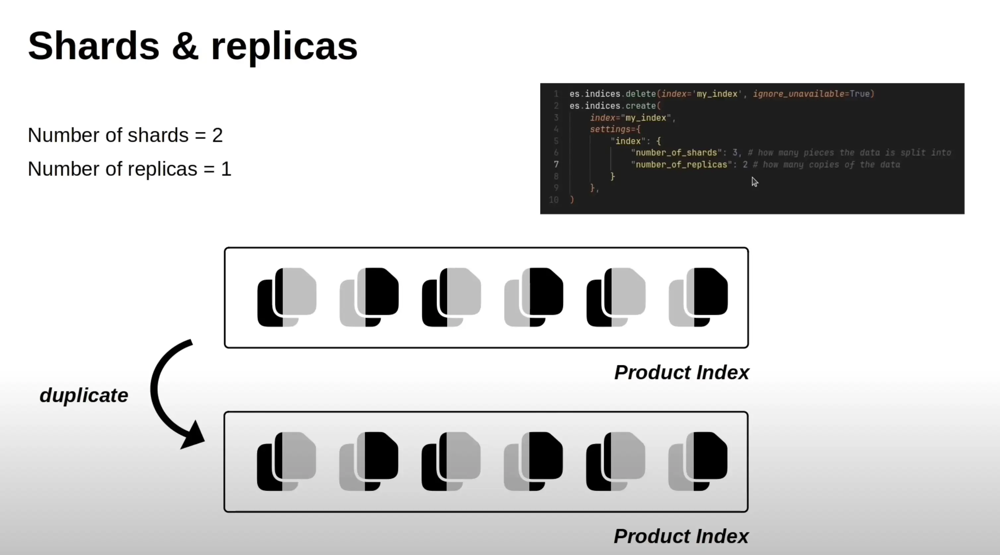

## 🔷 1. **Shards là gì?**

- **Shards** là cách Elasticsearch chia nhỏ dữ liệu của 1 **index** thành nhiều phần để:

  - Tăng **hiệu năng** (đọc/ghi song song).
  - Cho phép xử lý **khối lượng dữ liệu lớn** vượt quá giới hạn 1 node.
  - Cho phép **phân tán dữ liệu** giữa nhiều node.

→ Ví dụ: nếu bạn có 1 triệu documents, chia ra 3 shards thì mỗi shard chỉ chứa khoảng 333,000 documents.

---

## 🔷 2. **Minh hoạ trong hình**

### Trên cùng:

- `Product Index` ban đầu là **một khối đơn**, chưa chia shard.

### Dưới:

- Sau khi cấu hình `"number_of_shards": 3`, index này được **chia làm 3 shard chính** (màu đen).
- Mỗi shard là một phần riêng biệt của toàn bộ dữ liệu.

---

## 🔷 3. **Cấu hình Shard trong code**

```python
es.indices.create(
  index="my_index",
  settings={
    "index": {
      "number_of_shards": 3  # Chia thành 3 phần (primary shards)
    }
  }
)
```

> Có thể thêm `"number_of_replicas": 1` nếu muốn 1 bản sao cho mỗi shard.

---

## ✅ Kết luận

| Thành phần        | Vai trò                                  |
| ----------------- | ---------------------------------------- |
| **Primary Shard** | Chứa dữ liệu gốc                         |
| **Replica Shard** | Bản sao, dùng cho backup và tăng tốc đọc |
| **Sharding**      | Cơ chế phân mảnh dữ liệu                 |
| **Replicating**   | Cơ chế nhân bản shard                    |

---

---

---



## 🔷 1. **Replica là gì?**

- **Replica shard** là bản **sao chép** của một **primary shard**.
- Dùng để:

  - **Tăng độ sẵn sàng**: nếu một shard chính (primary) bị lỗi hoặc node chết → hệ thống vẫn hoạt động bình thường.
  - **Tăng hiệu năng đọc**: Elasticsearch có thể truy vấn từ replica thay vì primary (phân tán tải đọc).

---

## 🔷 2. **Giải thích hình minh hoạ**

### ⚙️ Cấu hình:

```python
{
  "number_of_shards": 3,
  "number_of_replicas": 2
}
```

- **Số lượng shards chính (primary)**: `3`
- **Số lượng replicas mỗi shard**: `2`

### 📦 Tổng số shards:

→ Mỗi shard chính có 2 bản sao → tổng số:

- 3 primary + 2 x 3 replicas = **9 shard**

---

### ✅ Trong hình:

#### Hàng đầu:

- 3 cặp màu **đen - xám** → Mỗi cặp là 1 primary + 1 replica.
- Chỉ mới có **1 replica** → ứng với `number_of_replicas = 1` (mặc dù trong code là 2, hình đang vẽ mức 1 replica).

#### Hàng dưới:

- Ghi chú **"duplicate"** → Replica được tạo thêm → tổng số shard tăng lên.

---

## 🔷 3. **Đặc điểm quan trọng của replica:**

| Tính năng                           | Mô tả                                                           |
| ----------------------------------- | --------------------------------------------------------------- |
| **Không nằm cùng node với primary** | Đảm bảo khi node chết không mất cả primary lẫn replica.         |
| **Chỉ đọc, không ghi**              | Replica chỉ dùng để đọc hoặc khôi phục khi primary bị mất.      |
| **Tự động đồng bộ**                 | Elasticsearch tự động sao chép dữ liệu từ primary sang replica. |

---

## ✅ Tóm tắt:

- **Primary shard** = nơi dữ liệu chính ghi vào.
- **Replica shard** = bản sao, chỉ dùng đọc hoặc backup.
- Replica = giúp **high availability** và **read scaling**.
- Tổng số shard thực tế = `(primary × (1 + number_of_replicas))`

---
